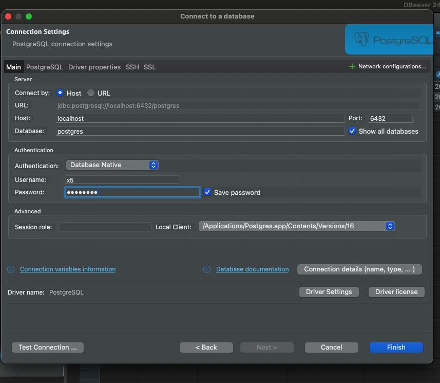

# Docker Basic

## Fragment 1: Basic & Rails

https://semaphoreci.com/community/tutorials/dockerizing-a-ruby-on-rails-application
https://schembri.me/rubymine-with-docker/


```shell
# RUN (CREATE NEW CONTAINER)
--name # para poner el nombre a tu contenedor
-p 3000:3000 # binding del puerto
-e 
-it # para interactuar con el contenedor
-v ${PWD}:/usr/src/app # enlaza el directorio actual a la ruta /usr/src/app del contenedor. Los cambios en el contenedor se replicaran fuera. 

```

```shell
# DOCKER COMPOSE
docker compose up -d
docker compose down
docker compose exec app rails db:migrate

```

```shell
# Si tienes DockerFile ES MEJOR DOCKER COMPOSE
docker build . # desde la ruta donde esta el archivo
```

```shell
# START (start an existing container) ES MEJOR DOCKER COMPOSE UP 
docker compose up -d # esto es mejor
docker start 45f79fc27b5f


# LOGS
docker logs a3816abd27e5
docker logs affectionate_fermi
docker logs --follow mongo_test #Quedar escuchando

```

```shell
# TERMINAL
docker exec -it my_container bash

# O un comando en especifico
docker exec -it my_container my_command

# Con enviroment
RAILS_ENV=production bundle exec rails c

# Rails
bundle exec rails c

# Postgres
docker cp db.backup <nombre_contenedor_postgres>:/db.backup
docker exec -it <nombre_contenedor_postgres> bash
pg_restore -U postgres -d my_database /db.backup
#o psql -U postgres -d my_database -f /db.backup

CREATE USER x5;
ALTER USER x5 WITH createdb;
ALTER USER x5 WITH superuser;
ALTER USER x5 WITH login;

\du # Para ver los usuarios

CREATE DATABASE x5_development;

psql -U x5 -d x5_development

docker cp /Users/shipedge/Documents/Programming/Shipedge/Dbs/nuevo.sql xenvio-db-1:/tmp/nuevo.sql

psql -U x5 x5_development < /tmp/nuevo.sql


# VALKEY
docker exec -it my-valkey-container valkey-cli
```

```shell
# NETWORK
docker network ls
docker network create mongo-network


```

```shell
# COPIAR ARCHIVO
docker cp D:\SHIPEDGE\XENVIO\x5.xenvio-master\nuevo.sql x5xenvio-master-db-1:/tmp/nuevo.sql
```


```shell
# RUBY ON RAILS
1. Configurar las variables de entorno como estan en el docker-compose(otro fragmento), igual el docker-entrypoint.
2. Una vez que ya tienes tu DockerFile configurado y el docker-compose correr: docker compose up -d  desde el directorio raiz
3. Configurar Dbeaver como en la foto
4. Acceder a la terminal 


```




```shell
# Detach Vita Wallet
docker compose run --rm --service-ports api
PORT=3001 npm start

docker run --rm -it \
  --name rails_marce \
  -v "$(pwd)":/rails \
  -v bundle:/usr/local/bundle \
  -p 3000:3000 \
  -p 12345:12345 \
  -e RAILS_ENV=development \
  -e REDIS_URL=redis://redis:6379/0 \
  -e postgres_user_password=postgres \
  -e postgres_user_name=postgres \
  -e postgres_host=postgres_api \
  -e postgres_port=5432 \
  -e redis_ip_address=redis_api \
  --network=$(docker network ls | grep $(basename $(pwd)) | awk '{print $1}') \
  --entrypoint bash \
  api:2025-01
  
  rdbg -n --open --host 0.0.0.0 --port 12345 -c -- rails server -b 0.0.0.0
  
  
  # VSCODE launch.json
  
  docker-compose
  
  {
    "version": "0.2.0",
    "configurations": [
      {
        "type": "rdbg",
        "name": "Attach to Docker rdbg",
        "request": "attach",
        "debugPort": "localhost:12345",
        "localfsMap": {
          "/rails": "${workspaceFolder}"
        },
        "showDebuggerOutput": true,
        "command": "rails server -b 0.0.0.0",
        "askParameters": false,
        "useBundler": true,
        "pathMaps": [
          {
            "localRoot": "${workspaceFolder}",
            "remoteRoot": "/rails"
          }
        ],
        "env": {
          "RAILS_ENV": "development"
        }
      }
    ]
  }
```

```shell
# KILL
docker kill $(docker ps -q)
```


## Fragment 2: DockerFile

```ruby
ARG RUBY_VERSION=3.3.1
FROM docker.io/library/ruby:$RUBY_VERSION-slim AS base

# Rails app lives here
WORKDIR /usr/src/rails

# Install base packages
RUN apt-get update -qq && \
    apt-get install --no-install-recommends -y curl libjemalloc2 libvips sqlite3 libpq-dev && \
    rm -rf /var/lib/apt/lists /var/cache/apt/archives

# Install packages needed to build gems
RUN apt-get update -qq && \
    apt-get install --no-install-recommends -y build-essential git pkg-config && \
    rm -rf /var/lib/apt/lists /var/cache/apt/archives

# Install application gems
COPY --link Gemfile Gemfile.lock ./
RUN bundle install && \
    bundle exec bootsnap precompile --gemfile && \
    rm -rf ~/.bundle/ "${BUNDLE_PATH}"/ruby/*/cache "${BUNDLE_PATH}"/ruby/*/bundler/gems/*/.git

# Copy application code
COPY --link . .

CMD ["rails", "server", "-b", "0.0.0.0"]
```

## Fragment 3: docker-compose.yml

```
version: '3.9'
services:
  app:
    build: . # Esto usara el Dockerfile que esta en el mismo directorio
    ports:
      - '3000:3000'
    volumes:
      - .:/usr/src/rails # Crearemos un volumen para linkear los cambios entre host y container
    environment:
      RAILS_ENV: ${RAILS_ENV}
      DATABASE_URL: ${DATABASE_URL}
    command: ['any_terminal_command']
    depends_on:
      - db
          
  db:
    container_name: postgres_database
    image: postgres:16
    environment:
      POSTGRES_USER: ${POSTGRES_USER}
      POSTGRES_PASSWORD: ${POSTGRES_PASSWORD}
      POSTGRES_DB: ${POSTGRES_DB}
    ports:
      - "6432:5432"
    volumes:
      - db_data:/var/lib/postgresql/data

volumes:
  db_data:
  
```


```
# .env
DATABASE_URL=postgresql://x5:password@db:5432/rails_app_development
POSTGRES_USER=x5
POSTGRES_PASSWORD=password
POSTGRES_DB=rails_app_development
```

## Fragment 4: docker-entrypoint

```
#!/bin/bash -e

# Add any container initialization steps here
rm -f /rails/tmp/pids/server.pid
rails db:prepare

exec "${@}"
```
