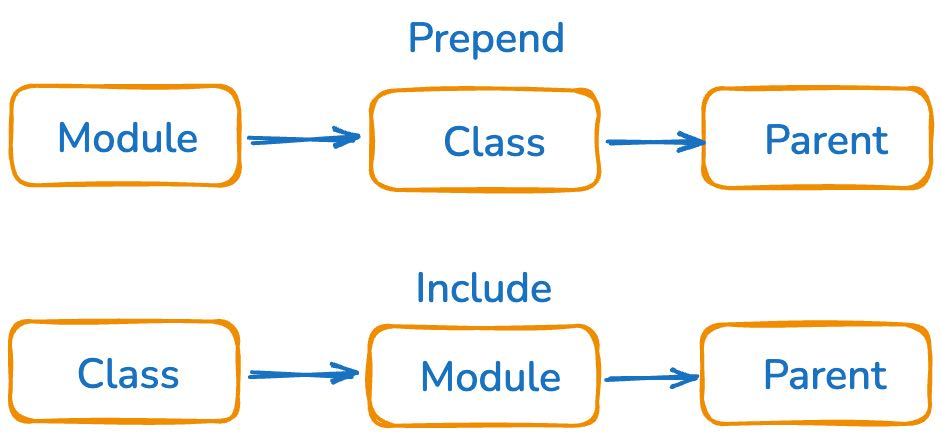
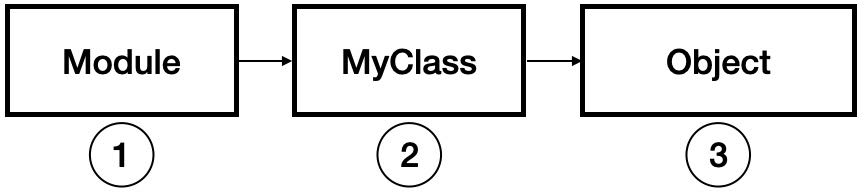

# Include VS Extend VS Prepend (MODULE)

```ruby
# INCLUDE se usa para poder usar los metodos de un modulo como metodos de instancia. (Busca primero en la clase luego en el modulo)
# EXTEND se usa para poder usar los metodos de un modulo como metodos de clase
# PREPEND se usa para poder usar los metodos de un modulo como decorators, pq se anade por detras en el ancestor chain (Busca primero en el modulo, luego en la clase)


# IMPORTANTE: lo que es private se mantiene en ambos casos
```





```ruby
# Prepend
# Busca primero en el modulo, luego en la clase
module MyDecorator
  def flowers
    flowers = 'more flowers'

    result = super

    puts "#{result} and #{flowers}"
  end
end

class MyClass
  prepend MyDecorator

  def flowers
    'some flowers'
  end
end

my_class = MyClass.new
my_class.flowers
```


```ruby
module Foo
  def foo
    puts 'foo'
  end
end

# Uso de include: Incorpora los métodos del módulo como métodos de instancia
class Bar1
  include Foo  # include mezcla el módulo Foo en Bar1, haciendo que sus métodos
               # estén disponibles como métodos de instancia para los objetos de Bar1
end

# Uso de extend: Incorpora los métodos del módulo como métodos de clase
class Bar2
  extend Foo   # extend agrega los métodos de Foo directamente al singleton class
               # de Bar2, lo que los convierte en métodos de clase (estáticos)
end


bar1 = Bar1.new
bar1.foo      

Bar2.foo       # Llama al método foo como método de clase

```
