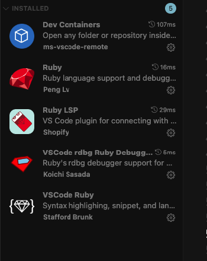

# Ruby Debug

```ruby
# Instalar gemas

# Debugging gems
  gem "debug", require: false
  gem 'pry-byebug'
  gem 'pry-rails'
```

```ruby
# Instalar extension VSCODE
```


```json
{
  // /.vscode/launch.json
  "version": "0.2.0",
  "configurations": [
    {
      "type": "rdbg",
      "name": "Debug Rails server",
      "request": "launch",
      "command": "bin/rails",
      "script": "server",
      "args": [],
      "askParameters": false,
      "useBundler": true
    },
    {
      "type": "rdbg",
      "name": "Debug current file with rdbg",
      "request": "launch",
      "script": "${file}",
      "args": [],
      "useBundler": false
    },
    {
    "type": "rdbg",
    "name": "Debug Rails test",
    "request": "launch",
    "command": "bundle",
    "script": "exec",
    "args": ["rspec", "${relativeFile}"],
    "askParameters": false,
    "useBundler": true
    },
    {
      "type": "rdbg",
      "name": "Attach with rdbg",
      "request": "attach"
    }
  ]
}

```

