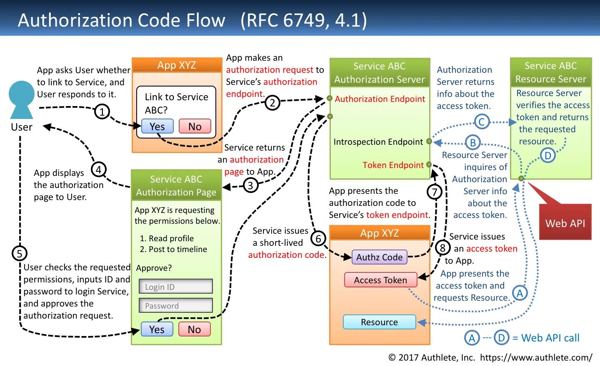

# OAuth 2.0 and OpenID

https://darutk.medium.com/diagrams-and-movies-of-all-the-oauth-2-0-flows-194f3c3ade85

```
OAuth 2.0 (corregido)

En OAuth 2.0, una aplicación (App1) se conecta a un servidor de autorización (App2) y el usuario debe poner sus credenciales en App2. El usuario elige qué permisos quiere conceder a App1, por ejemplo, acceso a las URLs de sus fotos. App2 genera un token de acceso y lo envía a App1. App1 usará ese token de acceso para hacer un request al endpoint de fotos en App2 y obtener las fotos del usuario.
```



```
OpenID Connect OIDC (corregido)

En OpenID Connect, el usuario quiere ingresar a App1 pero quiere usar las credenciales que ya tiene en App2. En la ventana de registro, elige acceder con App2, lo que abre una ventana de login de App2. App2 valida las credenciales del usuario y devuelve un ID Token (que es un JWT) con los datos del usuario a App1. Con esos datos, App1 puede crear una nueva cuenta o autenticar al usuario. En su backend, App1 verificará la firma del ID Token usando la clave pública de App2 cada vez que el usuario inicie sesión de esa manera.
```


```shell
# ENTENDER STATE FLOW

Flujo detallado del ataque CSRF en OAuth2 (sin parámetro state)
Fase 1: Preparación del ataque

El atacante crea su propia cuenta en Google (gmail@attacker.com)
Inicia el flujo OAuth normal hacia tu aplicación:

Visita: tuapp.com/auth/google
Tu backend redirige a: accounts.google.com/oauth/authorize?client_id=TU_APP&redirect_uri=tuapp.com/callback


Se autentica con SU cuenta de Google

Ingresa sus credenciales: gmail@attacker.com
Google le muestra el consent screen
Autoriza que TU aplicación acceda a sus datos


Fase 2: Interceptación del código

Google genera el authorization code y está a punto de redirigir a:
tuapp.com/callback?code=ABC123_CODIGO_DEL_ATACANTE
El atacante NO permite que se complete esta redirección:

Cierra el navegador
Intercepta la request con herramientas de desarrollo
O simplemente copia la URL antes de que se ejecute


Ahora el atacante tiene un código VÁLIDO pero NO USADO que autoriza el acceso a SU cuenta de Google

Fase 3: Ejecución del ataque

El atacante construye un ataque:

Crea un link malicioso: tuapp.com/callback?code=ABC123_CODIGO_DEL_ATACANTE
Lo disfraza en un email de phishing
O lo pone en un sitio web que controla
O usa técnicas de ingeniería social


La víctima (usuario legítimo) hace clic en el link

Puede pensar que está iniciando sesión normalmente
O ni siquiera darse cuenta (si el link está oculto en un iframe)


Fase 4: Consecuencias del ataque

Tu backend procesa el callback:

Recibe el código válido
Lo intercambia con Google por un access token
Google devuelve los datos del ATACANTE (gmail@attacker.com)
Tu backend crea una sesión/JWT para gmail@attacker.com


La víctima queda logueada en la cuenta del atacante:

Ve el dashboard de una cuenta vacía/nueva
Puede pensar que es su cuenta pero "perdió sus datos"
O puede no darse cuenta del cambio


Fase 5: Explotación

La víctima usa la aplicación pensando que es SU cuenta:

Sube documentos confidenciales
Ingresa información personal
Conecta sus cuentas bancarias
Configura sus preferencias


El atacante accede a toda esta información:

Se loguea normalmente con gmail@attacker.com
Ve todo lo que la víctima ingresó
Puede modificar o eliminar la información


Por qué funciona este ataque
Sin el parámetro state, tu backend no puede distinguir entre:

Un flujo OAuth iniciado legítimamente por el usuario actual
Un código de autorización generado en otro contexto/sesión

# Cómo el parámetro state previene esto

Usuario legítimo inicia OAuth:

Backend genera state único: "xyz789"
Lo almacena temporalmente asociado a esta "intención de login"
Redirige a Google incluyendo: &state=xyz789


Si el atacante intenta el mismo ataque:

Su URL maliciosa sería: tuapp.com/callback?code=ABC123
NO tiene el parámetro state
Backend rechaza: "Missing state parameter"


Incluso si el atacante incluye un state:

URL: tuapp.com/callback?code=ABC123&state=fake123
Backend verifica: "fake123" no existe en el storage temporal
Backend rechaza: "Invalid state"
```

