# Patterns Ruby (BEHAVIORALS)

## Fragment 1: Template (Inheritance)

```ruby
# El pa­trón Te­m­pla­te Me­thod te pe­r­mi­te co­n­ve­r­tir un al­go­ri­t­mo mo­no­lí­ti­co en una serie de pasos in­di­vi­dua­les que se pue­den ex­te­n­der fá­ci­l­me­n­te con su­b­cla­ses, ma­n­te­nie­n­do in­ta­c­ta la es­tru­c­tu­ra de­fi­ni­da en una superclase.

# Si tienes un algoritmo que tiene una variante entre sus pasos puedes usar template para sacar esa variante en subclases.
```

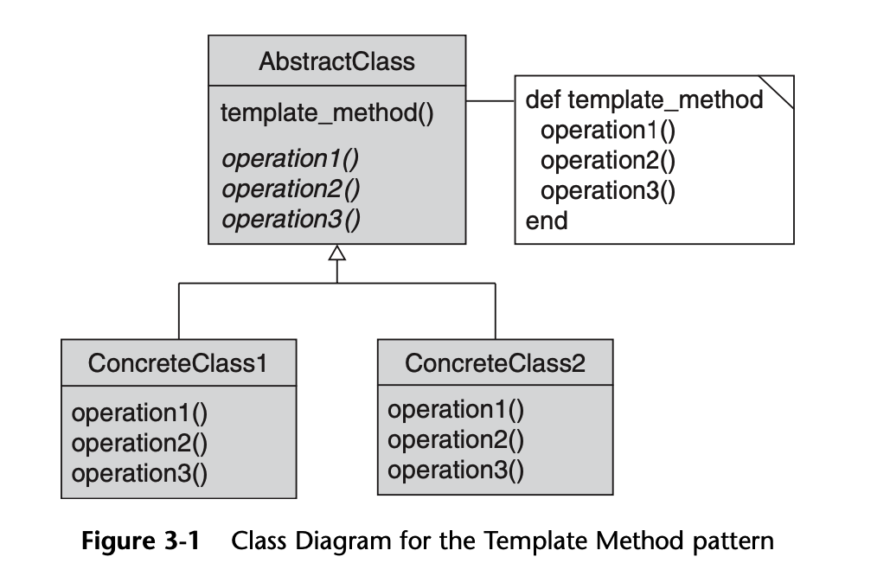

```ruby
# 1. Ana­li­za el al­go­ri­t­mo ob­je­ti­vo para ver si pue­des di­vi­di­r­lo en pasos. Co­n­si­de­ra qué pasos son co­mu­nes a todas las su­b­cla­ses y cuá­les sie­m­pre serán únicos.

# 2. Crea la clase base ab­s­tra­c­ta y de­cla­ra el mé­to­do pla­n­ti­lla y un grupo de mé­to­dos ab­s­tra­c­tos que re­pre­se­n­ten los pasos del al­go­ri­t­mo. Pe­r­fi­la la es­tru­c­tu­ra del al­go­ri­t­mo en el mé­to­do pla­n­ti­lla eje­cu­ta­n­do los pasos co­rre­s­po­n­die­n­tes. Co­n­si­de­ra de­cla­rar el mé­to­do pla­n­ti­lla como final para evi­tar que las su­b­cla­ses lo sobrescriban.

# 3. No hay pro­ble­ma en que todos los pasos aca­ben sie­n­do ab­s­tra­c­tos. Sin em­ba­r­go, a al­gu­nos pasos les ve­n­dría bien tener una im­ple­me­n­ta­ción por de­fe­c­to. Las su­b­cla­ses no tie­nen que im­ple­me­n­tar esos métodos.

# 4. Pie­n­sa en aña­dir hooks entre los pasos cru­cia­les del algoritmo.Para cada va­ria­ción del al­go­ri­t­mo, crea una nueva su­b­cla­se co­n­cre­ta. Ésta debe im­ple­me­n­tar todos los pasos ab­s­tra­c­tos, pero ta­m­bién puede so­bre­s­cri­bir al­gu­nos de los opcionales.
```

```ruby
# Módulo que actúa como una clase abstracta.
# Define la estructura del algoritmo mediante el método template_method.
# Algunas partes son fijas (base_operationX), otras son variables y deben ser implementadas por las clases concretas (required_operationsX).
# También incluye "hooks" opcionales que las clases hijas pueden sobrescribir si lo desean.
module AbstractClass
  # Método plantilla (Template Method).
  # Define el esqueleto del algoritmo general. Este método no debe cambiar en las subclases.
  def template_method
    base_operation1       # Paso fijo no requiere implementarse en el child
    required_operations1  # Paso requerido que debe implementarse
    hook1                 # Hook opcional
  end

  # Operaciones base comunes que no deben cambiar.
  def base_operation1
    puts 'AbstractClass says: I am doing the bulk of the work'
  end

  # Métodos requeridos: deben ser implementados por las clases concretas.
  def required_operations1
    raise NotImplementedError, "#{self.class} has not implemented method '#{__method__}'"
  end

  # Hooks opcionales: pueden ser sobrescritos, pero no es obligatorio.
  def hook1; end
end
```

```ruby
# Clase concreta que implementa los pasos requeridos del algoritmo.
class ConcreteClass1
  include AbstractClass

  def required_operations1
    puts 'ConcreteClass1 says: Implemented Operation1'
  end

  # Puedes sobrescribir un hook si necesitas lógica adicional:
  # def hook1
  #   puts 'ConcreteClass1 says: Custom hook1 logic'
  # end
end


# Otra clase concreta con la misma estructura de plantilla, pero con diferente comportamiento.
class ConcreteClass2
  include AbstractClass

  def required_operations1
    puts 'ConcreteClass2 says: Implemented Operation1'
  end
end
```

```ruby
# Código cliente que usa la interfaz abstracta sin importar la implementación concreta.
# Esto demuestra el principio de inversión de dependencias: el cliente depende de una abstracción, no de una implementación concreta.
puts 'Same client code can work with different subclasses:'
concrete_class1 = ConcreteClass1.new
concrete_class1.template_method
puts "\n"

puts 'Same client code can work with different subclasses:'
concrete_class2 = ConcreteClass2.new
concrete_class2.template_method
```

## Fragment 2: Strategy (Delegate)

```ruby
# Permite definir una familia de algoritmos, encapsular cada uno de ellos y hacerlos intercambiables dentro del contexto donde se usan.
# Lo usas cuando tienes variaciones para una MISMA TAREA.

# Sirve para:

    # Evitar condicionales grandes (como case o muchos if).

    # Permitir que el comportamiento de una clase se modifique sin cambiar su código.

    # Favorecer la extensibilidad: puedes agregar nuevas estrategias sin tocar el Context.
```
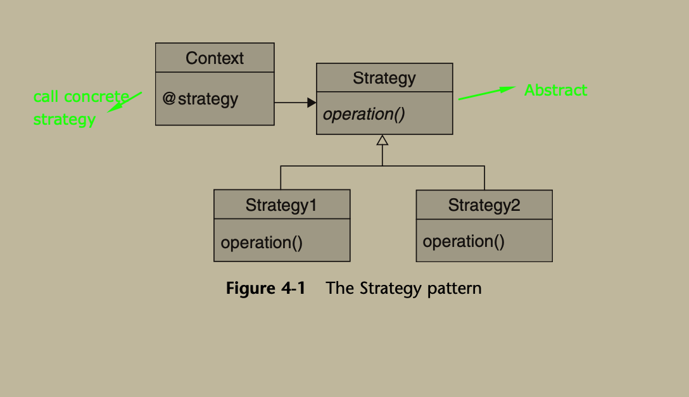

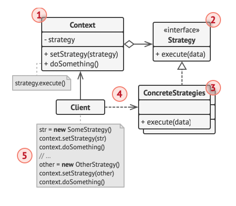


```ruby
# 1. En la clase co­n­te­x­to, ide­n­ti­fi­ca un al­go­ri­t­mo que tie­n­da a su­frir ca­m­bios fre­cue­n­tes. Ta­m­bién puede ser un eno­r­me co­n­di­cio­nal que se­le­c­cio­ne y eje­cu­te una va­ria­n­te del mismo al­go­ri­t­mo du­ra­n­te el tie­m­po de ejecución.

# 2. De­cla­ra la in­te­r­faz es­tra­te­gia común a todas las va­ria­n­tes del algoritmo.

# 3. Uno a uno, ex­trae todos los al­go­ri­t­mos y po­n­los en sus pro­pias cla­ses. Todas deben im­ple­me­n­tar la misma in­te­r­faz estrategia.

# 4. En la clase co­n­te­x­to, añade un campo para al­ma­ce­nar una re­fe­re­n­cia a un ob­je­to de es­tra­te­gia. Pro­po­r­cio­na un mo­di­fi­ca­dor set para su­s­ti­tuir va­lo­res de ese campo. La clase co­n­te­x­to debe tra­ba­jar con el ob­je­to de es­tra­te­gia úni­ca­me­n­te a tra­vés de la in­te­r­faz es­tra­te­gia. La clase co­n­te­x­to puede de­fi­nir una in­te­r­faz que pe­r­mi­ta a la es­tra­te­gia ac­ce­der a sus datos.

# 5. Los clie­n­tes de la clase co­n­te­x­to deben aso­ciar­la con una es­tra­te­gia ade­cua­da que coin­ci­da con la forma en la que es­pe­ran que la clase co­n­te­x­to reali­ce su tra­ba­jo principal.
```

```ruby
# Contexto: Esta clase usará una estrategia (algoritmo) que puede cambiarse en tiempo de ejecución.
class Context
  attr_writer :strategy  # Permite cambiar la estrategia desde fuera (setter público).

  def initialize(strategy)
    @strategy = strategy  # Inyección inicial de la estrategia.
  end

  def do_some_business_logic
    puts 'Context: Sorting data using the strategy (not sure how it\'ll do it)'
    
    # Aquí se delega la lógica específica a la estrategia actual.
    result = @strategy.do_algorithm(%w[a c b e d])
    
    # Resultado según la estrategia seleccionada.
    print result.join(',')
  end
end
```

```ruby
# Módulo Strategy: Define la interfaz común para todas las estrategias concretas.
module Strategy
  def do_algorithm(_data)
    raise NotImplementedError, "#{self.class} has not implemented method '#{__method__}'"
  end
end

# Estrategia concreta A: Implementa el algoritmo específico de ordenamiento normal (ascendente).
class ConcreteStrategyA
  include Strategy

  def do_algorithm(data)
    data.sort
  end
end

# Estrategia concreta B: Implementa el algoritmo específico de ordenamiento descendente.
class ConcreteStrategyB
  include Strategy

  def do_algorithm(data)
    data.sort.reverse
  end
end
```

```ruby
# CLIENT

context = Context.new(ConcreteStrategyA.new)
puts 'Client: Strategy is set to normal sorting.'
context.do_some_business_logic
puts "\n\n"

# Cliente: Cambia la estrategia en tiempo de ejecución.
puts 'Client: Strategy is set to reverse sorting.'
context.strategy = ConcreteStrategyB.new
context.do_some_business_logic
```

## Fragment 3: Observer

```ruby
# Tambien conocido como Publish/Subscribe
# Pe­r­mi­te de­fi­nir un me­ca­ni­s­mo de su­s­cri­p­ción para no­ti­fi­car a va­rios ob­je­tos sobre cua­l­quier eve­n­to que le su­ce­da al ob­je­to que están observando.
```

```ruby
# Ruby ya tiene un modulo listo
require 'observer'

class Test1
  include Observable
  def salary=(new_salary)
    @salary = new_salary
    changed # este flag booleano es del modulo observer que sirve para estar serguro que algo cambio. Una vez que notifica vuelve a false.
    notify_observers(self)
  end
end
```
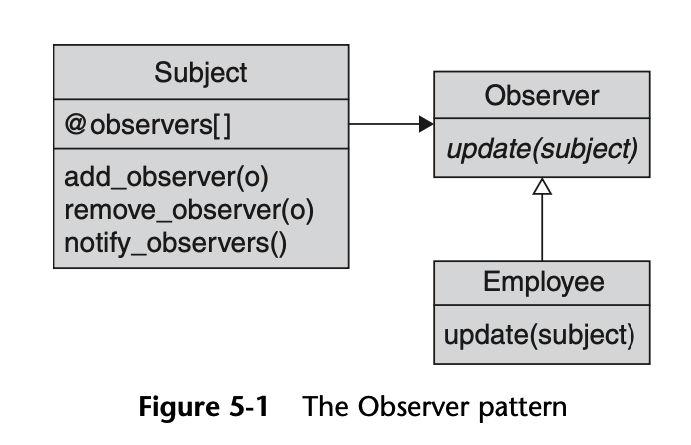

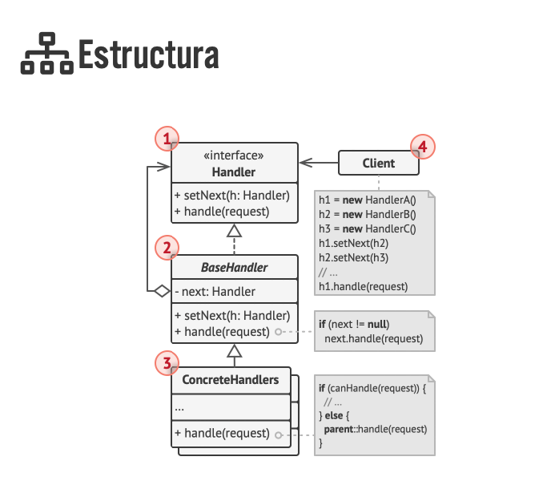

```ruby
# 1. Re­pa­sa tu ló­gi­ca de ne­go­cio e in­te­n­ta di­vi­di­r­la en dos pa­r­tes: la fu­n­cio­na­li­dad ce­n­tral, in­de­pe­n­die­n­te del resto de có­di­go, ac­tua­rá como no­ti­fi­ca­dor; el resto se co­n­ve­r­ti­rá en un grupo de cla­ses suscriptoras.

# 2. De­cla­ra la in­te­r­faz su­s­cri­p­to­ra. Como mí­ni­mo, de­be­rá de­cla­rar un único mé­to­do actualizar.

# 3. De­cla­ra la in­te­r­faz no­ti­fi­ca­do­ra y de­s­cri­be un par de mé­to­dos para aña­dir  y eli­mi­nar de la lista un ob­je­to su­s­cri­p­tor. Re­cue­r­da que los no­ti­fi­ca­do­res deben tra­ba­jar con su­s­cri­p­to­res úni­ca­me­n­te a tra­vés de la in­te­r­faz suscriptora.

# 4. De­ci­de dónde co­lo­car la lista de su­s­cri­p­ción y la im­ple­me­n­ta­ción de mé­to­dos de su­s­cri­p­ción. No­r­ma­l­me­n­te, este có­di­go tiene el mismo as­pe­c­to para todos los tipos de no­ti­fi­ca­do­res, por lo que el lugar obvio para co­lo­car­lo es en una clase ab­s­tra­c­ta de­ri­va­da di­re­c­ta­me­n­te de la in­te­r­faz no­ti­fi­ca­do­ra. Los no­ti­fi­ca­do­res co­n­cre­tos ex­tie­n­den esa clase, he­re­da­n­do el co­m­po­r­ta­mie­n­to de suscripción. Sin em­ba­r­go, si estás apli­ca­n­do el pa­trón a una je­ra­r­quía de cla­ses exi­s­te­n­tes, co­n­si­de­ra una so­lu­ción ba­sa­da en la co­m­po­si­ción: co­lo­ca la ló­gi­ca de la su­s­cri­p­ción en un ob­je­to se­pa­ra­do y haz que todos los no­ti­fi­ca­do­res reales la utilicen.

# 5. Crea cla­ses no­ti­fi­ca­do­ras co­n­cre­tas. Cada vez que su­ce­da algo im­po­r­ta­n­te de­n­tro de una no­ti­fi­ca­do­ra, de­be­rá no­ti­fi­car a todos sus suscriptores.

# 6. Im­ple­me­n­ta los mé­to­dos de no­ti­fi­ca­ción de ac­tua­li­za­cio­nes en cla­ses su­s­cri­p­to­ras co­n­cre­tas. La ma­yo­ría de las su­s­cri­p­to­ras ne­ce­si­ta­rán cie­r­ta in­fo­r­ma­ción de co­n­te­x­to sobre el eve­n­to, que puede pa­sar­se como ar­gu­me­n­to del mé­to­do de notificación. Pero hay otra op­ción. Al re­ci­bir una no­ti­fi­ca­ción, el su­s­cri­p­tor puede ex­traer la in­fo­r­ma­ción di­re­c­ta­me­n­te de ella. En este caso, el no­ti­fi­ca­dor debe pa­sar­se a sí mismo a tra­vés del mé­to­do de ac­tua­li­za­ción. La op­ción menos fle­xi­ble es vi­n­cu­lar un no­ti­fi­ca­dor con el su­s­cri­p­tor de forma pe­r­ma­ne­n­te a tra­vés del constructor.

# 7. “El clie­n­te debe crear todos los su­s­cri­p­to­res ne­ce­sa­rios y re­gi­s­trar­los con los no­ti­fi­ca­do­res adecuados.

```

```ruby
module Publishable
  def register_observer(observer)
    raise NotImplementedError, "#{self.class} has not implemented method '#{__method__}'"
  end

  def delete_observer(observer)
    raise NotImplementedError, "#{self.class} has not implemented method '#{__method__}'"
  end

  def notify_observers(message)
    raise NotImplementedError, "#{self.class} has not implemented method '#{__method__}'"
  end
end
```

```ruby
class Publisher
  include Publishable

  def initialize
    @observers = []
  end

  def register_observer(observer)
    @observers << observer
  end

  def delete_observer(observer)
    @observers.delete(observer)
  end

  def notify_observers(message)
    @observers.each do |observer|
      observer.notify(message)
    end
  end
end
```

```ruby
module Observable
  def notify
    raise NotImplementedError, "#{self.class} has not implemented method '#{__method__}'"
  end
end
```


```ruby
class Observer1
  include Observable

  def initialize
    @name = 'obs1'
  end

  def notify(message)
    puts "#{@name} received message: #{message}"
  end
end

class Observer2
  include Observable

  def initialize
    @name = 'obs2'
  end

  def notify(message)
    puts "#{@name} received message: #{message}"
  end
end
```

```ruby
# Client

obs1 = Observer1.new
obs2 = Observer2.new

publisher = Publisher.new
publisher.register_observer(obs1)
publisher.register_observer(obs2)

publisher.notify_observers('Hello, world!')

```
publisher.register_observer(sms)```


## Fragment 4: Chain of Responsability

```ruby
# Permite pasar solicitudes a lo largo de una cadena de objetos. Cada objeto en la cadena decide si puede manejar la solicitud o si debe pasarla al siguiente objeto en la cadena.
```

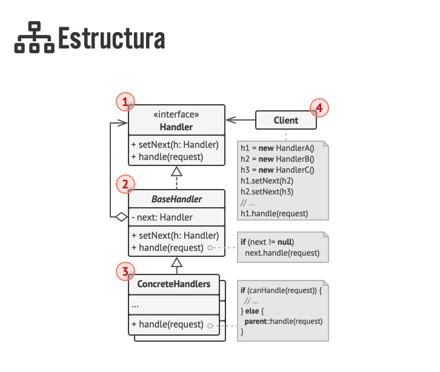


```ruby
# 1. De­cla­ra la in­te­r­faz ma­ne­ja­do­ra y de­s­cri­be la firma de un mé­to­do para ma­ne­jar solicitudes. De­ci­de cómo pa­sa­rá el clie­n­te la in­fo­r­ma­ción de la so­li­ci­tud de­n­tro del mé­to­do. La forma más fle­xi­ble co­n­si­s­te en co­n­ve­r­tir la so­li­ci­tud en un ob­je­to y pa­sar­lo al mé­to­do de ge­s­tión como argumento.

# 2. Para eli­mi­nar có­di­go boi­le­r­pla­te du­pli­ca­do en ma­ne­ja­do­res co­n­cre­tos, puede me­re­cer la pena crear una clase ma­ne­ja­do­ra ab­s­tra­c­ta base, de­ri­va­da de la in­te­r­faz manejadora. Esta clase debe tener un campo para al­ma­ce­nar una re­fe­re­n­cia al si­guie­n­te ma­ne­ja­dor de la ca­de­na. Co­n­si­de­ra hacer la clase in­mu­ta­ble. No ob­s­ta­n­te, si pla­neas mo­di­fi­car las ca­de­nas du­ra­n­te el tie­m­po de eje­cu­ción, de­be­rás de­fi­nir un mo­di­fi­ca­dor (se­t­ter) para al­te­rar el valor del campo de referencia. Ta­m­bién pue­des im­ple­me­n­tar el co­m­po­r­ta­mie­n­to por de­fe­c­to co­n­ve­nie­n­te para el mé­to­do de co­n­trol, que co­n­si­s­te en re­en­viar la so­li­ci­tud al si­guie­n­te ob­je­to, a no ser que no quede ni­n­guno. Los ma­ne­ja­do­res co­n­cre­tos po­drán uti­li­zar este co­m­po­r­ta­mie­n­to in­vo­ca­n­do al mé­to­do padre.

# 3. Una a una, crea su­b­cla­ses ma­ne­ja­do­ras co­n­cre­tas e im­ple­me­n­ta los mé­to­dos de co­n­trol. Cada ma­ne­ja­dor debe tomar dos de­ci­sio­nes cua­n­do re­ci­be una solicitud: Si pro­ce­sa la solicitud. Si pasa la so­li­ci­tud al si­guie­n­te es­la­bón de la cadena.

# 4. El clie­n­te puede en­sa­m­blar ca­de­nas por su cue­n­ta o re­ci­bir ca­de­nas pre­fa­bri­ca­das de otros ob­je­tos. En el úl­ti­mo caso, debes im­ple­me­n­tar al­gu­nas cla­ses fá­bri­ca para crear ca­de­nas de acue­r­do con los aju­s­tes de co­n­fi­gu­ra­ción o de entorno.

# 5. El clie­n­te puede ac­ti­var cua­l­quier ma­ne­ja­dor de la ca­de­na, no solo el pri­me­ro. La so­li­ci­tud se pa­sa­rá a lo largo de la ca­de­na hasta que algún ma­ne­ja­dor se rehú­se a pa­sar­lo o hasta que lle­gue al final de la cadena.

# 6. De­bi­do a la na­tu­ra­le­za di­ná­mi­ca de la ca­de­na, el clie­n­te debe estar listo para ge­s­tio­nar los si­guie­n­tes escenarios:
# La ca­de­na puede co­n­si­s­tir en un único vínculo.
# Al­gu­nas so­li­ci­tu­des pue­den no lle­gar al final de la cadena.
# Otras pue­den lle­gar hasta el final de la ca­de­na sin ser gestionadas.

```

```ruby
# Módulo Handler define la interfaz que deben implementar los manejadores en la cadena.
module Handler
  # Método para asignar el siguiente manejador en la cadena
  def next_handler=(handler)
    raise NotImplementedError, "#{self.class} has not implemented method '#{__method__}'"
  end

  # Método abstracto para manejar la solicitud
  def handle(request)
    raise NotImplementedError, "#{self.class} has not implemented method '#{__method__}'"
  end
end
```

```ruby
# Clase base para los manejadores concretos
class AbstractHandler
  include Handler  # Incluye la interfaz Handler para forzar la implementación de los métodos.

  attr_writer :next_handler  # Permite asignar el siguiente manejador.

  # Método para encadenar manejadores.
  def next_handler(handler)
    @next_handler = handler
    handler  # Retorna el manejador para permitir encadenamiento en la configuración.
  end

  # Método para procesar la solicitud o delegarla al siguiente manejador.
  def handle(request)
    return @next_handler.handle(request) if @next_handler  # Si hay un siguiente manejador, pasa la solicitud.

    nil  # Si no hay más manejadores en la cadena, retorna nil.
  end
end
```

```ruby
# Manejador concreto: Mono
class MonkeyHandler < AbstractHandler
  def handle(request)
    if request == 'Banana'
      "Monkey: I'll eat the #{request}"  # El mono solo maneja solicitudes con 'Banana'.
    else
      super(request)  # Si no puede manejar la solicitud, la pasa al siguiente manejador en la cadena.
    end
  end
end

# Manejador concreto: Ardilla
class SquirrelHandler < AbstractHandler
  def handle(request)
    if request == 'Nut'
      "Squirrel: I'll eat the #{request}"  # La ardilla maneja solicitudes con 'Nut'.
    else
      super(request)  # Pasa la solicitud al siguiente manejador si no puede procesarla.
    end
  end
end

# Manejador concreto: Perro
class DogHandler < AbstractHandler
  def handle(request)
    if request == 'Meat'
      "Dog: I'll eat the #{request}"  # El perro maneja solicitudes con 'Meat'.
    else
      super(request)  # Pasa la solicitud si no puede manejarla.
    end
  end
end
```

```ruby
# Client

monkey = MonkeyHandler.new
squirrel = SquirrelHandler.new
dog = DogHandler.new

# Encadenamos los manejadores: Monkey -> Squirrel -> Dog
monkey.next_handler(squirrel).next_handler(dog)

# Prueba de la cadena con diferentes solicitudes
%w[Banana Nut Meat Apple].each do |food|
  result = monkey.handle(food)  # Se inicia la solicitud desde el primer manejador.

  if result.nil?
    puts "Untouched #{food}"  # Si ningún manejador procesó la solicitud, se indica que no fue manejada.
  else
    puts result  # Se imprime el resultado del manejador que procesó la solicitud.
  end
end
```

```

## Fragment 5: Command

```ruby
# El Patrón Command es un patrón de diseño de comportamiento que encapsula una solicitud como un objeto, permitiendo parametrizar clientes con diferentes solicitudes, hacer un historial de comandos y deshacer operaciones.
# Trata de convertir una solicitud (una acción) en un objeto. Imagina que tienes un botón en una aplicación. En lugar de que el botón realice la acción directamente, crea un objeto "comando" que contiene toda la información necesaria para realizar esa acción.
```
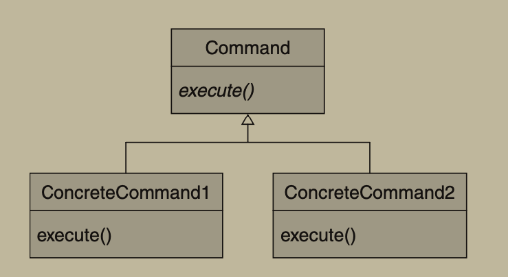

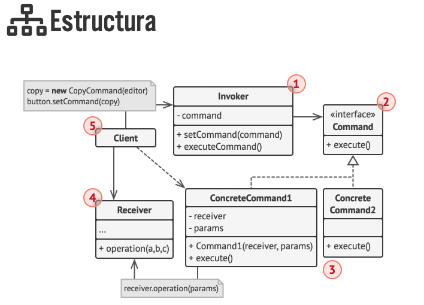


```ruby
# 1. De­cla­ra la in­te­r­faz de co­ma­n­do con un único mé­to­do de ejecución.

# 2. Em­pie­za ex­tra­ye­n­do so­li­ci­tu­des y po­nié­n­do­las de­n­tro de cla­ses co­n­cre­tas de co­ma­n­do que im­ple­me­n­ten la in­te­r­faz de co­ma­n­do. Cada clase debe co­n­tar con un grupo de ca­m­pos para al­ma­ce­nar los ar­gu­me­n­tos de las so­li­ci­tu­des junto con re­fe­re­n­cias al ob­je­to re­ce­p­tor. Todos estos va­lo­res deben ini­cia­li­zar­se a tra­vés del co­n­s­tru­c­tor del comando.

# 3. Ide­n­ti­fi­ca cla­ses que ac­túen como emi­so­ras. Añade los ca­m­pos para al­ma­ce­nar co­ma­n­dos de­n­tro de estas cla­ses. Las emi­so­ras de­be­rán co­mu­ni­car­se con sus co­ma­n­dos tan solo a tra­vés de la in­te­r­faz de co­ma­n­do. No­r­ma­l­me­n­te las emi­so­ras no crean ob­je­tos de co­ma­n­do por su cuenta, sino que los ob­tie­nen del có­di­go cliente.

# 4. Ca­m­bia las emi­so­ras de forma que eje­cu­ten el co­ma­n­do en lugar de en­viar di­re­c­ta­me­n­te una so­li­ci­tud al receptor.

# 5. El clie­n­te debe ini­cia­li­zar ob­je­tos en el si­guie­n­te orden:

# Crear receptores.
# Crear co­ma­n­dos y aso­ciar­los con re­ce­p­to­res si es necesario.
# Crear emi­so­res y aso­ciar­los con co­ma­n­dos específicos.

```

```ruby
# Módulo Command que define una interfaz para todos los comandos.
# Cualquier clase que implemente este módulo debe definir el método `execute`.
module Command
  def execute
    raise NotImplementedError, "#{self.class} has not implemented method '#{__method__}'"
  end
  
  def undone
    raise NotImplementedError, "#{self.class} has not implemented method '#{__method__}'"
  end
end
```

```ruby
# Comando Simple: Implementa la interfaz Command.
# Este comando simplemente imprime un mensaje con el `payload` recibido.
class SimpleCommand
  include Command

  def initialize(payload)
    @payload = payload
  end

  def execute
    puts "SimpleCommand: See, I can do simple things like printing (#{@payload})"
  end
  
  # Deshacer ultima accion
  def undone
    puts "SimpleCommand: Undone last operation (#{@payload})"
  end
end
```

```ruby
# Comando Complejo: Implementa la interfaz Command.
# Este comando delega parte de su ejecución a un "Receiver" que se encargará
# de ejecutar las acciones más específicas.
class ComplexCommand
  include Command

  def initialize(receiver, a, b)
    @receiver = receiver  # Objeto que ejecutará las acciones
    @a = a
    @b = b
  end

  def execute
    print 'ComplexCommand: Complex stuff should be done by a receiver object'
    @receiver.do_something(@a)       # Llama a la primera acción del receptor
    @receiver.do_something_else(@b)  # Llama a la segunda acción del receptor
  end
  
  # Deshacer ultima accion
  def undone
    puts "ComplexCommand: Can not undone (#{@payload})"
  end
  
end

# Receiver: Clase que realiza las operaciones reales.
# Se encarga de ejecutar las tareas más específicas delegadas por el comando complejo.
class Receiver
  def do_something(a)
    print "\nReceiver: Working on (#{a}.)"
  end

  def do_something_else(b)
    print "\nReceiver: Also working on (#{b}.)"
  end
end
```

```ruby
# Invoker: Se encarga de almacenar y ejecutar comandos en respuesta a eventos.
# Define dos métodos `on_click` y `on_focus`, que asignan comandos a ejecutar.
class Invoker
  def on_click(command)
    @on_click = command  # Asigna un comando que se ejecutará cuando ocurra un "click"
  end

  def on_focus(command)
    @on_focus = command  # Asigna un comando que se ejecutará cuando ocurra un "focus"
  end

  # Método que ejecuta los comandos asignados (si existen).
  def perform_action
    if @on_click
      @on_click.execute
      @last_command = @on_click
    end

    if @on_focus
      @on_focus.execute
      @last_command = @on_focus
    end
  end
  
  # Método para deshacer el último comando ejecutado
  def undo_last_action
    if @last_command
      @last_command.undo
      @last_command = nil
    else
      puts 'Invoker: No actions to undone.'
    end
  end
end
```


```ruby
# Cliente: Configura el invocador con diferentes comandos y ejecuta acciones.
invoker = Invoker.new

# Se asigna un comando simple al evento de "click"
invoker.on_click(SimpleCommand.new('Say Hi!'))
invoker.perform_action  # Ejecuta el comando simple

# Se asigna un comando complejo al evento de "focus"
invoker.on_focus(ComplexCommand.new(Receiver.new, 'Send email', 'Save report'))
invoker.perform_action  # Ejecuta el comando complejo con el receptor
```


## Fragment 6: Iterator

```ruby
# Permite recorrer los elementos de una colección sin exponer su estructura interna (lista, pila, árbol, etc.).
```

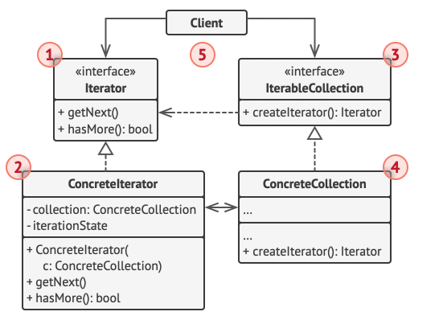

```ruby
# 1. De­cla­ra la in­te­r­faz ite­ra­do­ra. Como mí­ni­mo, debe tener un mé­to­do para ex­traer el si­guie­n­te ele­me­n­to de una co­le­c­ción. Por co­n­ve­nie­n­cia, pue­des aña­dir un par de mé­to­dos di­s­ti­n­tos, como para ex­traer el ele­me­n­to pre­vio, lo­ca­li­zar la po­si­ción ac­tual o co­m­pro­bar el final de la iteración.

# 2. De­cla­ra la in­te­r­faz de co­le­c­ción y de­s­cri­be un mé­to­do para bu­s­car ite­ra­do­res. El tipo de re­to­rno debe ser igual al de la in­te­r­faz itera­do­ra. Pue­des de­cla­rar mé­to­dos si­mi­la­res si pla­neas tener va­rios gru­pos di­s­ti­n­tos de iteradores.

# 3. Im­ple­me­n­ta cla­ses ite­ra­do­ras co­n­cre­tas para las co­le­c­cio­nes que quie­ras que sean re­co­rri­das por ite­ra­do­res. Un ob­je­to ite­ra­dor debe estar vi­n­cu­la­do a una única in­s­ta­n­cia de la co­le­c­ción. No­r­ma­l­me­n­te, este ví­ncu­lo se es­ta­ble­ce a tra­vés del co­n­s­tru­c­tor del iterador.

# 4 Im­ple­me­n­ta la in­te­r­faz de co­le­c­ción en tus cla­ses de co­le­c­ción. La idea pri­n­ci­pal es pro­po­r­cio­nar al clie­n­te un atajo para crear ite­rado­res pe­r­so­na­li­za­dos para una clase de co­le­c­ción pa­r­ti­cu­lar. El ob­je­to de co­le­c­ción debe pa­sar­se a sí mismo al co­n­s­tru­c­tor del ite­ra­dor para es­ta­ble­cer un ví­ncu­lo entre ellos.

# 5 Re­pa­sa el có­di­go clie­n­te para su­s­ti­tuir todo el có­di­go de re­co­rri­do de la co­le­c­ción por el uso de ite­ra­do­res. El clie­n­te busca un nuevo ob­je­to ite­ra­dor cada vez que ne­ce­si­ta re­co­rrer los ele­me­n­tos de la colección.
```

```ruby
class AlphabeticalOrderIterator
  # Incluir enumerable para poder sobreescribir each
  include Enumerable

  attr_accessor :reverse
  private :reverse

  attr_accessor :collection
  private :collection

  def initialize(collection, reverse: false)
    @collection = collection
    @reverse = reverse
  end

  def each(&block)
    return @collection.reverse.each(&block) if reverse

    @collection.each(&block)
  end
end
```


```ruby
class WordsCollection
  attr_accessor :collection
  private :collection

  def initialize(collection = [])
    @collection = collection
  end

  # El método `iterator` devuelve un objeto iterador. Por defecto,
  # devolvemos el iterador en orden ascendente.
  def iterator
    AlphabeticalOrderIterator.new(@collection)
  end

  def reverse_iterator
    AlphabeticalOrderIterator.new(@collection, reverse: true)
  end

  # @param [String] item
  def add_item(item)
    @collection << item
  end
end
```


```ruby
# CLIENT
collection = WordsCollection.new
collection.add_item('First')
collection.add_item('Second')
collection.add_item('Third')

puts 'Recorrido en orden normal:'
collection.iterator.each { |item| puts item }
puts "\n"

puts 'Recorrido en orden inverso:'
collection.reverse_iterator.each { |item| puts item }
```

## Fragment 7: Mediator

```ruby
# Permite reducir el acoplamiento directo entre clases, haciendo que todas asl dependencias que se tienen pasesa  un intermediario llamado Mediador
```

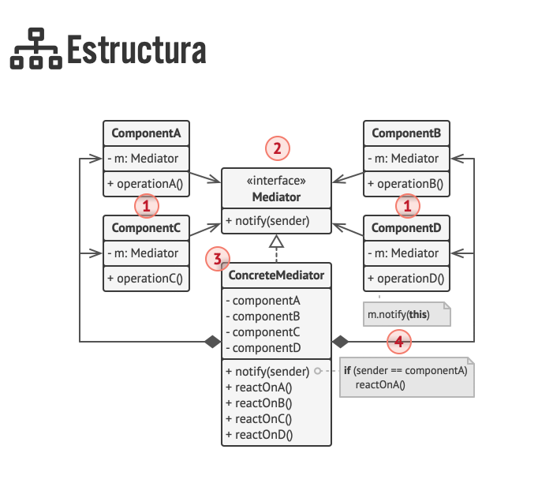


```ruby
# 1. Ide­n­ti­fi­ca un grupo de cla­ses fue­r­te­me­n­te aco­pla­das que se be­ne­fi­cia­rían de ser más in­de­pe­n­die­n­tes (p. ej., para un ma­n­te­ni­mie­n­to más se­n­ci­llo o una re­uti­li­za­ción más si­m­ple de esas clases).

# 2. De­cla­ra la in­te­r­faz me­dia­do­ra y de­s­cri­be el pro­to­co­lo de co­mu­ni­ca­ción de­sea­do entre me­dia­do­res y otros va­rios co­m­po­ne­n­tes. En la ma­yo­ría de los casos, un único mé­to­do para re­ci­bir no­ti­fi­ca­cio­nes de los co­m­po­ne­n­tes es suficiente. Esta in­te­r­faz es fu­n­da­me­n­tal cua­n­do quie­ras re­uti­li­zar las cla­ses del co­m­po­ne­n­te en di­s­ti­n­tos co­n­te­x­tos. Sie­m­pre y cua­n­do el co­m­po­ne­n­te tra­ba­je con su me­dia­dor a tra­vés de la in­te­r­faz ge­né­ri­ca, po­drás vi­n­cu­lar el co­m­po­ne­n­te con una im­ple­me­n­ta­ción di­fe­re­n­te del mediador.

# 3. Im­ple­me­n­ta la clase co­n­cre­ta me­dia­do­ra. Esta clase se be­ne­fi­cia­rá de al­ma­ce­nar re­fe­re­n­cias a todos los co­m­po­ne­n­tes que gestiona.

# 4. Pue­des ir más lejos y hacer la in­te­r­faz me­dia­do­ra re­s­po­n­sa­ble de la crea­ción y de­s­tru­c­ción de ob­je­tos del co­m­po­ne­n­te. Tras esto, la me­dia­do­ra puede pa­re­ce­r­se a una fá­bri­ca o una fa­cha­da.

# 5. Los co­m­po­ne­n­tes deben al­ma­ce­nar una re­fe­re­n­cia al ob­je­to me­dia­dor. La co­ne­xión se es­ta­ble­ce no­r­ma­l­me­n­te en el co­n­s­tru­c­tor del co­m­po­ne­n­te, donde un ob­je­to me­dia­dor se pasa como argumento.

# 6. Ca­m­bia el có­di­go de los co­m­po­ne­n­tes de forma que in­vo­quen el mé­to­do de no­ti­fi­ca­ción del me­dia­dor en lugar de los mé­to­dos de otros co­m­po­ne­n­tes. Ex­trae el có­di­go que im­pli­que lla­mar a otros co­m­po­ne­n­tes de­n­tro de la clase me­dia­do­ra. Eje­cu­ta este có­di­go cua­n­do el me­dia­dor re­ci­ba no­ti­fi­ca­cio­nes de ese componente.
```

```ruby
# Módulo que define la interfaz del mediador.
# En este caso solo define el método `notify`, que debe ser implementado por clases concretas.
module MyMediator
  def notify
    raise NotImplementedError, "#{self.class} has not implemented method '#{__method__}'"
  end
end
```

```ruby
# Clase concreta que implementa el mediador.
# Es responsable de coordinar la comunicación entre los componentes.
class ConcreteMediator
  include MyMediator

  def initialize(*args)
    # Guarda los componentes y les asigna este mediador.
    @components = args.map do |arg|
      arg.mediator = self
      arg
    end
  end

  # Método que reacciona a eventos enviados por los componentes.
  # Dependiendo del evento, toma decisiones sobre qué acciones deben ejecutarse.
  def notify(_sender, event)
    if event == 'A'
      puts 'Mediator reacts on A and triggers following operations:'
      @components[1].do_c
    elsif event == 'D'
      puts 'Mediator reacts on D and triggers following operations:'
      @components[0].do_b
      @components[1].do_c
    end
  end
end
```

```ruby
# Clase base para los componentes que colaboran con el mediador.
# Cada componente tiene una referencia al mediador que lo coordina.
class BaseComponent
  attr_accessor :mediator

  def initialize(mediator = nil)
    @mediator = mediator
  end
end

# Primer componente concreto.
# Realiza acciones y notifica al mediador sobre eventos.
class Component1 < BaseComponent
  def do_a
    puts 'Component 1 does A.'
    @mediator.&notify(self, 'A') # Notifica al mediador que ocurrió el evento A
  end

  def do_b
    puts 'Component 1 does B.'
    @mediator.&notify(self, 'B') # Notifica al mediador que ocurrió el evento B (aunque en este ejemplo no hay lógica en el mediador para 'B')
  end
end

# Segundo componente concreto.
# También realiza acciones y notifica eventos al mediador.
class Component2 < BaseComponent
  def do_c
    puts 'Component 2 does C.'
    @mediator.&notify(self, 'C') # Notifica al mediador que ocurrió el evento C
  end

  def do_d
    puts 'Component 2 does D.'
    @mediator.&notify(self, 'D') # Notifica al mediador que ocurrió el evento D
  end
end
```

```ruby
# CLIENT
# Creamos dos componentes
c1 = Component1.new
c2 = Component2.new

# Creamos el mediador y lo asociamos a los componentes
ConcreteMediator.new(c1, c2)

# Cliente desencadena una acción del componente 1
puts 'Client triggers operation A.'
c1.do_a

puts "\n"

# Cliente desencadena una acción del componente 2
puts 'Client triggers operation D.'
c2.do_d
```

## Fragment 8: Memento

```ruby

```

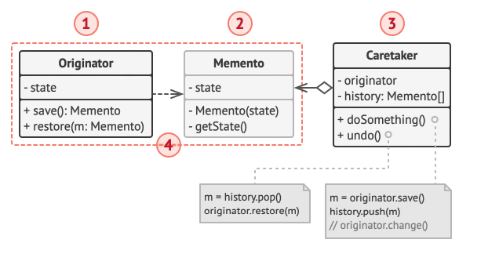

```ruby
# 1. De­te­r­mi­na qué clase ju­ga­rá el papel de la ori­gi­na­do­ra. Es im­po­r­ta­n­te saber si el pro­gra­ma uti­li­za un ob­je­to ce­n­tral de este tipo o va­rios más pequeños.

# 2. Crea la clase me­me­n­to. Uno a uno, de­cla­ra un grupo de ca­m­pos que re­fle­jen los ca­m­pos de­cla­ra­dos de­n­tro de la clase originadora.

# 3. Haz la clase me­me­n­to in­mu­ta­ble. Una clase me­me­n­to debe ace­p­tar los datos sólo una vez, a tra­vés del co­n­s­tru­c­tor. La clase no debe tener mo­di­fi­ca­do­res.

# 4. Crea una in­te­r­faz de la clase me­me­n­to y haz que el resto de ob­je­tos la uti­li­cen para re­mi­ti­r­se a ella. Pue­des aña­dir ope­ra­cio­nes de me­ta­da­tos a la in­te­r­faz, pero nada que ex­po­n­ga el es­ta­do de la originadora.

# 5. Añade un mé­to­do para pro­du­cir me­me­n­tos a la clase ori­gi­na­do­ra. La ori­gi­na­do­ra debe pasar su es­ta­do a la clase me­me­n­to a tra­vés de uno o va­rios ar­gu­me­n­tos del co­n­s­tru­c­tor del memento. El tipo de re­to­rno del mé­to­do debe ser del mismo que la in­te­r­faz que ex­tra­ji­s­te en el paso an­te­rior (asu­mie­n­do que lo hi­ci­s­te). Bá­si­ca­me­n­te, el mé­to­do pro­du­c­tor del me­me­n­to debe tra­ba­jar di­re­c­ta­me­n­te con la clase memento.

# 6. Añade un mé­to­do para re­s­tau­rar el es­ta­do del ori­gi­na­dor a su clase. Debe ace­p­tar un ob­je­to me­me­n­to como ar­gu­me­n­to. Si ex­tra­ji­s­te una in­te­r­faz en el paso pre­vio, haz que sea el tipo del pa­rá­me­tro. En este caso, debes es­pe­ci­fi­car el tipo del ob­je­to en­tra­n­te al de la clase me­me­n­to, ya que la ori­gi­na­do­ra ne­ce­si­ta pleno ac­ce­so a ese objeto.

# 7. La cui­da­do­ra, in­de­pe­n­die­n­te­me­n­te de que re­pre­se­n­te un ob­je­to de co­ma­n­do, un hi­s­to­rial, o algo to­ta­l­me­n­te di­fe­re­n­te, debe saber cuá­n­do so­li­ci­tar nue­vos me­me­n­tos de la ori­gi­na­do­ra, cómo al­ma­ce­nar­los y cuá­n­do re­s­tau­rar la ori­gi­na­do­ra con un me­me­n­to particular.

# 8. El ví­ncu­lo entre cui­da­do­ras y ori­gi­na­do­ras puede mo­ve­r­se de­n­tro de la clase me­me­n­to. En este caso, cada me­me­n­to debe co­ne­c­tar­se a la ori­gi­na­do­ra que lo creó. El mé­to­do de re­s­tau­ra­ción ta­m­bién se mo­ve­rá a la clase me­me­n­to. No ob­s­ta­n­te, todo esto sólo te­n­drá se­n­ti­do si la clase me­me­n­to está ani­da­da de­n­tro de la ori­gi­na­do­ra o la clase ori­gi­na­do­ra pro­po­r­cio­na su­fi­cie­n­tes mo­di­fi­ca­do­res para so­bre­s­cri­bir su estad
```

```ruby
# Clase que representa al Originador (el objeto con estado interno).
class Originator
  # Definimos el estado como atributo accesible solo dentro de la clase
  attr_accessor :state
  private :state

  def initialize(state)
    @state = state
    puts "Originator: My initial state is: #{@state}"
  end

  # Método que simula una operación que modifica el estado interno
  def do_something
    puts 'Originator: I\'m doing something important.'
    @state = generate_random_string(10)
    puts "Originator: and my state has changed to: #{@state}"
  end

  # Guarda el estado actual en un Memento (crea una instantánea del estado)
  def save
    ConcreteMemento.new(@state)
  end

  # Restaura el estado desde un Memento
  def restore(memento)
    @state = memento.state
    puts "Originator: My state has changed to: #{@state}"
  end

  private

  # Genera una cadena aleatoria para simular cambios de estado
  def generate_random_string(length = 10)
    ascii_letters = [*'a'..'z', *'A'..'Z']
    (0...length).map { ascii_letters.sample }.join
  end
end
```


```ruby
# Módulo que define la interfaz del Memento (contrato).
module Memento
  def name
    raise NotImplementedError, "#{self.class} has not implemented method '#{__method__}'"
  end

  def date
    raise NotImplementedError, "#{self.class} has not implemented method '#{__method__}'"
  end
end
```

```ruby
# Implementación concreta del Memento que guarda el estado y una marca de tiempo.
class ConcreteMemento
  include Memento

  attr_reader :state, :date

  def initialize(state)
    @state = state
    @date = Time.now.strftime('%F %T')  # Fecha y hora formateada
  end

  # Nombre amigable del memento (fecha + parte del estado)
  def name
    "#{@date} / (#{@state[0, 9]}...)"
  end
end
```


```ruby
# Clase Caretaker: administra los mementos sin acceder directamente al contenido del estado.
class Caretaker
  def initialize(originator)
    @originator = originator
    @mementos = []
  end

  # Crea una copia de seguridad del estado actual
  def backup
    puts "\nCaretaker: Saving Originator's state..."
    @mementos << @originator.save
  end

  # Restaura el último estado guardado
  def undo
    return if @mementos.empty?

    memento = @mementos.pop
    puts "Caretaker: Restoring state to: #{memento.name}"

    begin
      @originator.restore(memento)
    rescue StandardError
      # Si ocurre un error restaurando, se intenta con el anterior
      undo
    end
  end

  # Muestra la lista de mementos guardados
  def show_history
    puts 'Caretaker: Here\'s the list of mementos:'
    @mementos.each { |memento| puts memento.name }
  end
end
```


```ruby
# CLIENT
# Creamos un originador con un estado inicial
originator = Originator.new('Super-duper-super-puper-super.')

# Creamos el caretaker para manejar los backups
caretaker = Caretaker.new(originator)

# Guardamos el estado inicial
caretaker.backup
# Hacemos algo que cambia el estado
originator.do_something

# Guardamos el nuevo estado
caretaker.backup
# Hacemos otro cambio
originator.do_something

puts "\n"
caretaker.show_history

# Deshacemos cambios
puts "\nClient: Now, let's rollback!\n"
caretaker.undo

puts "\nClient: Once more!\n"
caretaker.undo
```

## Fragment 9: State

```ruby
# Es como una maquina de estado que acepta ciertas transiciones.
```

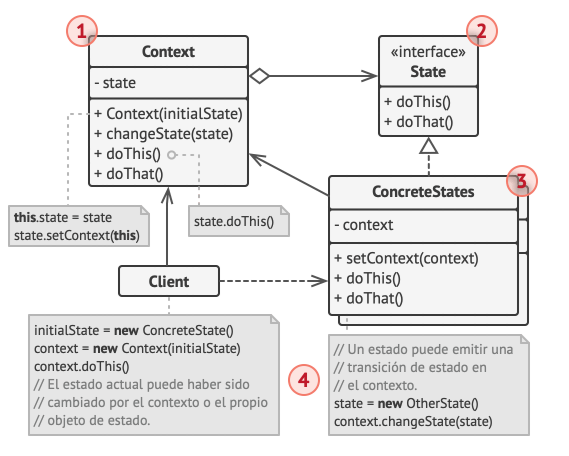


```ruby
# 1. De­ci­de qué clase ac­tua­rá como co­n­te­x­to. Puede ser una clase exi­s­te­n­te que ya tiene el có­di­go de­pe­n­die­n­te del es­ta­do, o una nueva clase, si el có­di­go es­pe­cí­fi­co del es­ta­do está di­s­tri­bui­do a lo largo de va­rias clases.

# 2. De­cla­ra la in­te­r­faz de es­ta­do. Au­n­que puede re­pli­car todos los mé­to­dos de­cla­ra­dos en el co­n­te­x­to, cé­n­tra­te en los que pue­den co­n­te­ner co­m­po­r­ta­mie­n­tos es­pe­cí­fi­cos del estado.

# 3. Para cada es­ta­do ac­tual, crea una clase de­ri­va­da de la in­te­r­faz de es­ta­do. De­s­pués re­pa­sa los mé­to­dos del co­n­te­x­to y ex­trae todo el có­di­go re­la­cio­na­do con ese es­ta­do para me­te­r­lo en tu clase re­cién creada. Al mover el có­di­go a la clase es­ta­do, puede que de­s­cu­bras que de­pe­n­de de mie­m­bros pri­va­dos del co­n­te­x­to. Hay va­rias so­lu­cio­nes alternativas:
# - Haz pú­bli­cos esos ca­m­pos o métodos.
# - Co­n­vie­r­te el co­m­po­r­ta­mie­n­to que estás ex­tra­ye­n­do para po­ne­r­lo en un mé­to­do pú­bli­co en el co­n­te­x­to e in­vó­ca­lo desde la clase de es­ta­do. Esta forma es des­agra­da­ble pero rá­pi­da y sie­m­pre po­drás arre­glar­lo más adelante.

# 4. En la clase co­n­te­x­to, añade un campo de re­fe­re­n­cia del tipo de in­te­r­faz de es­ta­do y un mo­di­fi­ca­dor (se­t­ter) pú­bli­co que pe­r­mi­ta so­bre­s­cri­bir el valor de ese campo.

# 5. Vue­l­ve a re­pa­sar el mé­to­do del co­n­te­x­to y su­s­ti­tu­ye los co­n­di­cio­na­les de es­ta­do va­cíos por lla­ma­das a mé­to­dos co­rre­s­po­n­die­n­tes del ob­je­to de estado.

# 6. Para ca­m­biar el es­ta­do del co­n­te­x­to, crea una in­s­ta­n­cia de una de las cla­ses de es­ta­do y pá­sa­la a la clase co­n­te­x­to. Pue­des hacer esto de­n­tro de la pro­pia clase co­n­te­x­to, en di­s­ti­n­tos es­ta­dos, o en el clie­n­te. Se haga de una forma u otra, la clase se vue­l­ve de­pe­n­die­n­te de la clase de es­ta­do co­n­cre­to que instancia.
```

```ruby
# Contexto principal que cambia su comportamiento en tiempo de ejecución
# dependiendo del estado actual.
class Context
  attr_accessor :state
  private :state # Evitamos que el estado se modifique directamente desde fuera

  def initialize(state)
    transition_to(state) # Inicia con un estado dado
  end

  # Cambia el estado actual por uno nuevo y establece el contexto del estado
  def transition_to(state)
    puts "Context: Transition to #{state.class}"
    @state = state
    @state.context = self # Permite que el estado conozca su contexto
  end

  # Delegación de la lógica al estado actual
  def request1
    @state.handle1
  end

  def request2
    @state.handle2
  end
end
```


```ruby
# Módulo con la interfaz común para los estados concretos
# Define métodos abstractos que deben implementar los estados concretos
module State
  attr_accessor :context # Permite que el estado acceda/modifique el contexto

  def handle1
    raise NotImplementedError, "#{self.class} has not implemented method '#{__method__}'"
  end

  def handle2
    raise NotImplementedError, "#{self.class} has not implemented method '#{__method__}'"
  end
end

# Estado concreto A
class ConcreteStateA
  include State

  def handle1
    puts 'ConcreteStateA handles request1.'
    puts 'ConcreteStateA wants to change the state of the context.'
    @context.transition_to(ConcreteStateB.new) # Cambia dinámicamente al estado B
  end

  def handle2
    puts 'ConcreteStateA handles request2.'
    # No cambia de estado aquí, simplemente ejecuta lógica propia
  end
end

# Estado concreto B
class ConcreteStateB
  include State

  def handle1
    puts 'ConcreteStateB handles request1.'
    # No cambia de estado aquí
  end

  def handle2
    puts 'ConcreteStateB handles request2.'
    puts 'ConcreteStateB wants to change the state of the context.'
    @context.transition_to(ConcreteStateA.new) # Cambia de regreso al estado A
  end
end
```


```ruby
# CLIENT
context = Context.new(ConcreteStateA.new)
context.request1  # Llama a handle1 de ConcreteStateA → cambia a B
context.request2  # Llama a handle2 de ConcreteStateB → cambia a A

```


## Fragment 10: Visitor

```ruby
# Permite separar algoritmos de los objetos sobre los que operan

# Uti­li­za el pa­trón Vi­si­tor cua­n­do ne­ce­si­tes rea­li­zar una ope­ra­ción sobre todos los ele­me­n­tos de una co­m­ple­ja es­tru­c­tu­ra de ob­je­tos (por eje­m­plo, un árbol de objetos).
```

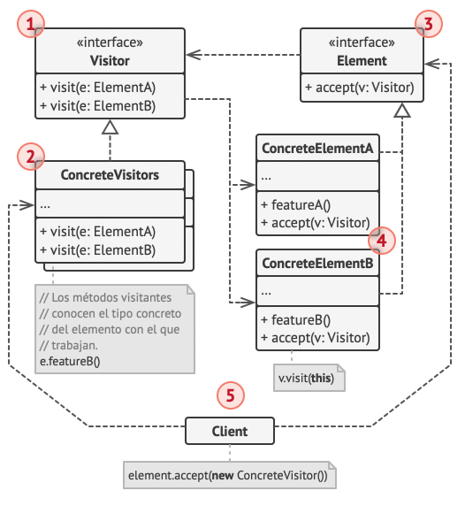

```ruby
# 1. De­cla­ra la in­te­r­faz vi­si­ta­n­te con un grupo de mé­to­dos “vi­si­ta­n­tes”, uno por cada clase de ele­me­n­to co­n­cre­to exi­s­te­n­te en el programa.

# 2. De­cla­ra la in­te­r­faz de ele­me­n­to. Si estás tra­ba­ja­n­do con una je­ra­r­quía de cla­ses de ele­me­n­to exi­s­te­n­te, añade el mé­to­do ab­s­tra­c­to de “ace­p­ta­ción” a la clase base de la je­ra­r­quía. Este mé­to­do debe ace­p­tar un ob­je­to vi­si­ta­n­te como argumento.

# 3. Im­ple­me­n­ta los mé­to­dos de ace­p­ta­ción en todas las cla­ses de ele­me­n­to co­n­cre­to. Estos mé­to­dos si­m­ple­me­n­te deben re­di­ri­gir la lla­ma­da a un mé­to­do vi­si­ta­n­te en el ob­je­to vi­si­ta­n­te en­tra­n­te que coin­ci­da con la clase del ele­me­n­to actual.

# 4. Las cla­ses de ele­me­n­to sólo deben fu­n­cio­nar con vi­si­ta­n­tes a tra­vés de la in­te­r­faz vi­si­ta­n­te. Los vi­si­ta­n­tes, sin em­ba­r­go, deben co­no­cer todas las cla­ses de ele­me­n­to co­n­cre­to, re­fe­re­n­cia­das como tipos de pa­rá­me­tro de los mé­to­dos de visita.

# 5. Por cada co­m­po­r­ta­mie­n­to que no pueda im­ple­me­n­tar­se de­n­tro de la je­ra­r­quía de ele­me­n­tos, crea una nueva clase co­n­cre­ta vi­si­ta­n­te e im­ple­me­n­ta todos los mé­to­dos visitantes. Puede que te en­cue­n­tres una si­tua­ción en la que el vi­si­ta­n­te ne­ce­si­te ac­ce­so a al­gu­nos mie­m­bros pri­va­dos de la clase ele­me­n­to. En este caso, pue­des hacer estos ca­m­pos o mé­to­dos pú­bli­cos, vio­la­n­do la en­ca­p­su­la­ción del ele­me­n­to.

# 6. El clie­n­te debe crear ob­je­tos vi­si­ta­n­tes y pa­sar­los de­n­tro de ele­me­n­tos a tra­vés de mé­to­dos de “ace­p­ta­ción”.

```

```ruby
# Interfaz del componente: define un método que acepta un visitante
module Component
  def accept(visitor)
    raise NotImplementedError, "#{self.class} has not implemented method '#{__method__}'"
  end
end

# Clase concreta A que implementa Component
class ConcreteComponentA
  include Component

  # Acepta un visitante y le delega la lógica específica de esta clase
  def accept(visitor)
    visitor.visit_concrete_component_a(self)
  end

  # Método exclusivo de esta clase concreta
  def exclusive_method_of_concrete_component_a
    'A'
  end
end

# Clase concreta B que también implementa Component
class ConcreteComponentB
  include Component

  # Igual que A, pero delega al método del visitante correspondiente
  def accept(visitor)
    visitor.visit_concrete_component_b(self)
  end

  def exclusive_method_of_concrete_component_b
    'B'
  end
end
```

```ruby
# Interfaz del visitante: define métodos para cada tipo de componente concreto
module Visitor
  def visit_concrete_component_a(_element)
    raise NotImplementedError, "#{self.class} has not implemented method '#{__method__}'"
  end

  def visit_concrete_component_b(_element)
    raise NotImplementedError, "#{self.class} has not implemented method '#{__method__}'"
  end
end

# Visitante concreto 1: implementa lógica personalizada para cada componente
class ConcreteVisitor1
  include Visitor

  def visit_concrete_component_a(element)
    # Usa métodos específicos del componente A
    puts "#{element.exclusive_method_of_concrete_component_a} + #{self.class}"
  end

  def visit_concrete_component_b(element)
    puts "#{element.exclusive_method_of_concrete_component_b} + #{self.class}"
  end
end

# Visitante concreto 2: otro tipo de comportamiento
class ConcreteVisitor2
  include Visitor

  def visit_concrete_component_a(element)
    puts "#{element.exclusive_method_of_concrete_component_a} + #{self.class}"
  end

  def visit_concrete_component_b(element)
    puts "#{element.exclusive_method_of_concrete_component_b} + #{self.class}"
  end
end
```

```ruby
# Creamos una lista de componentes
components = [ConcreteComponentA.new, ConcreteComponentB.new]

# Aplicamos diferentes visitantes sobre los mismos componentes
puts 'The client code works with all visitors via the base Visitor interface:'
visitor1 = ConcreteVisitor1.new

components.each do |component|
  component.accept(visitor1)
end

puts 'It allows the same client code to work with different types of visitors:'
visitor2 = ConcreteVisitor2.new
components.each do |component|
  component.accept(visitor2)
end
```
