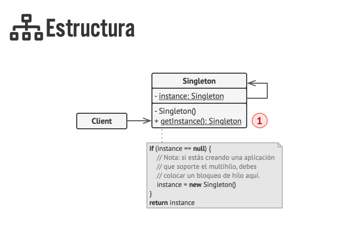
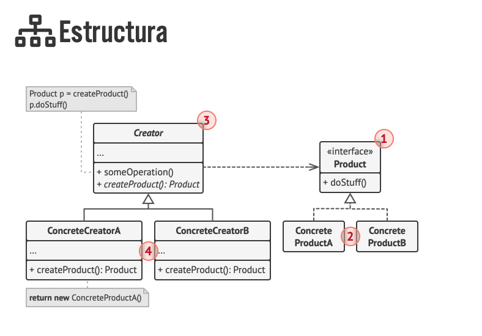
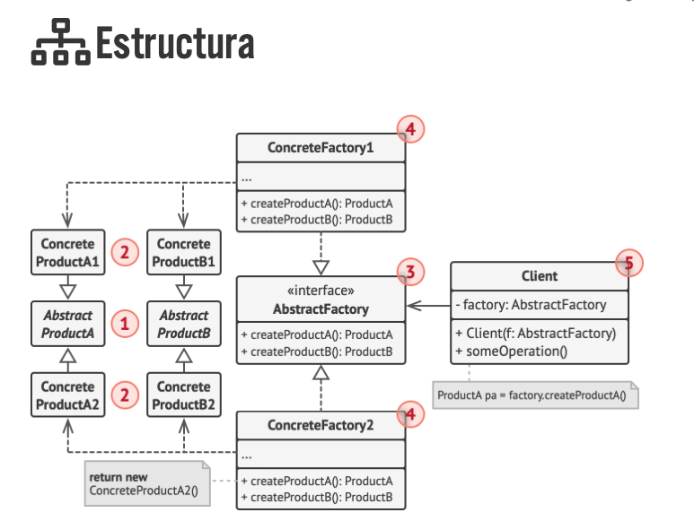
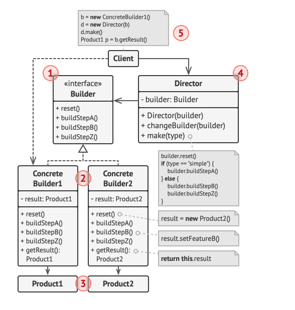
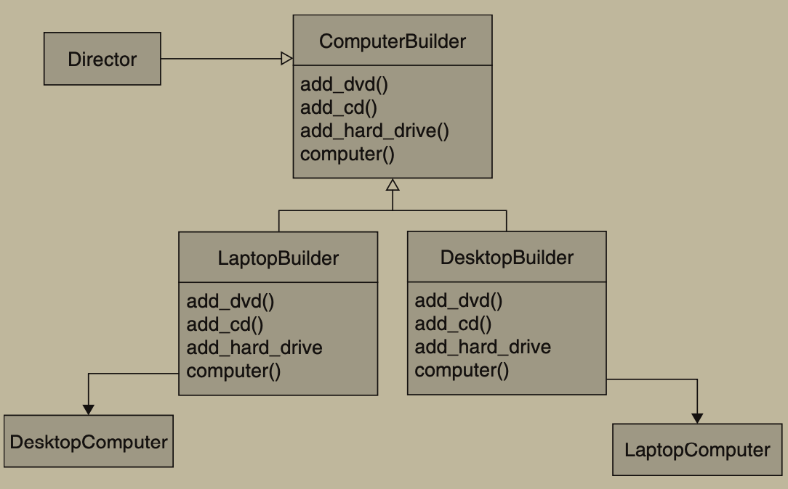

# Patterns Ruby (CREATIONALS)

## Fragment 1: Singleton

```ruby
# **** El patrón Singleton garantiza que una clase tenga una única instancia en toda la aplicación y proporciona un punto global de acceso a esa instancia. ****

# Administrar conexiones a bases de datos.
# Controlar acceso a recursos compartidos (como un archivo de configuración o un logger).
# Mantener el estado global de una aplicación.
```



```ruby
# 1. Definir una variable de instancia en la clase (@instance) para almacenar la única instancia.
# 2. Hacer que el constructor (new) sea privado para evitar instancias directas fuera de la clase.
# 3. Proveer un método de clase (self.instance) que controle la creación y acceso a la instancia única.
# 4. Utilizar Mutex para asegurar concurrencia si el Singleton se usa en entornos multi-hilo.
# 5. Evitar reinicialización con valores diferentes y lanzar un error si se intenta cambiar la configuración.


# MAS DETALLES
# 1. De­cla­ra un mé­to­do de crea­ción pú­bli­co para ob­te­ner la in­s­ta­n­cia Singleton (def instace).
# 2. Im­ple­me­n­ta una ini­cia­li­za­ción di­fe­ri­da de­n­tro del mé­to­do. Debe crear un nuevo ob­je­to en su pri­me­ra lla­ma­da y co­lo­car­lo de­n­tro de la variable de instancia @instance. El mé­to­do de­be­rá de­vo­l­ver @instance sie­m­pre en todas las lla­ma­das siguientes.
# 3. De­cla­ra el co­n­s­tru­c­tor de clase como pri­va­do. El mé­to­do instance se­gui­rá sie­n­do capaz de in­vo­car al co­n­s­tru­c­tor

```

```ruby
class MySingleton
  # Define un método getter para obtener el valor de configuración.
  attr_reader :config_value

  # Mutex para asegurar que solo un hilo pueda modificar la instancia a la vez.
  @@mutex = Mutex.new
  
  # Método de clase que retorna la única instancia del Singleton.
  def self.instance(config_value = nil)
    @@mutex.synchronize do
      if @instance.nil?
        @instance = new(config_value)
      elsif config_value && @instance.config_value != config_value
        raise ArgumentError, "config_value already set to #{@instance.config_value}"
      end
      
      @instance
    end
  end

  private
  
  # Constructor privado para evitar que se creen instancias directamente.
  def initialize(config_value = nil)
    raise ArgumentError, "config value can not be nil" if config_value.nil?
    
    @config_value = config_value.freeze
  end

  # Hace que el método `new` sea privado, evitando instanciación externa.
  private_class_method :new
end

```

```ruby
# CLIENT

instance1 = MySingleton.instance("configuration_value_23")
puts instance1.config_value # => "configuration_value_23"

instance2 = MySingleton.instance
puts instance2.config_value # => "configuration_value_23"

# Intentar cambiar el valor lanza un error
begin
  MySingleton.instance("new_value") # => ArgumentError
rescue ArgumentError => e
  puts e.message
end


#
```


```ruby
# USANDO SINGLETON MODULE DE RUBY (RECOMENDADO)
require 'singleton'

class MySingletonWithModule
  include Singleton

  attr_reader :config_value

  def configure(config_value)
    if @config_value.nil?
      @config_value = config_value.freeze
    elsif @config_value != config_value
      raise ArgumentError, "config_value already set to #{@config_value}"
    end
  end
end
```

## Fragment 2: Factory

```ruby
# **** Es un patrón de diseño creacional ideal para objetos simples que proporciona una interfaz para crear objetos en una superclase, pero permite que las subclases decidan qué tipo de objeto se instanciará. ****

# Se utiliza para abstraer y centralizar la creación de objetos, evitando exponer directamente la lógica de instanciación y facilitando la extensibilidad del código. Ejemplos típicos incluyen:
# Crear objetos que comparten una misma interfaz o clase base, pero cuyas implementaciones pueden variar.
# Manejar casos donde la lógica de creación es compleja o depende de parámetros específicos.
```




```ruby
# Step 1 CREAR UNA INTERFACE (Puedes hacerlo como una clase pero es mejor con modulo)
module Shape
  def draw
    # Si el metodo no es sobreescrito en la clase que lo implementa salta este error:
    raise NotImplementedError, "#{self.class} has not implemented method '#{__method__}'"
  end
end
```

```ruby
# STEP 2 IMPLEMENTAR LA INTERFACE

# CONCRETE PRODUCT A
class Circle
  include Shape
  
  def draw
    puts('circle draw')
  end
end

# CONCRETE PRODUCT B
class Square
  include Shape
  
  def draw
    puts('square draw')
  end
end

```

```ruby

# Step 3 CREAR EL FACTORY. TIENE QUE RETORNAR UN OBJETO QUE IMPLEMENTE LA INTERFACE "PRODUCTO"

class ShapeFactory
  def create_shape(type)
    case type
    when 'circle'
      Circle.new
    when 'square'
      Square.new
    else
      raise ArgumentError, "Unknown shape type: #{type}"
    end
  end
end
```

```ruby
# STEP 4 LLAMAR AL FACTORY

circle = ShapeFactory.new.create_shape('circle')
circle.draw
square = ShapeFactory.new.create_shape('square')
square.draw
```

## Fragment 3: Abstract Factory

```ruby
# Proporciona una interfaz para crear familias de objetos relacionados o dependientes sin especificar sus clases concretas. Este patrón es útil cuando el sistema debe ser independiente de cómo se crean, componen y representan sus productos.
```


```ruby
# Paso 1: Definir las interfaces de los productos.
module Chair
  def sit_on
    raise NotImplementedError, "#{self.class} has not implemented method '#{__method__}'"
  end
end

module Table
  def put_on
    raise NotImplementedError, "#{self.class} has not implemented method '#{__method__}'"
  end
end

```


```ruby
# Paso 2: Definir las clases de los productos concretos.
class ModernChair
  include Chair
  
  def sit_on
    'Sitting on a modern chair.'
  end
end

class ModernTable
  include Table
  
  def put_on
    'Putting something on a modern table.'
  end
end

class VintageChair
  include Chair
  
  def sit_on
    'Sitting on a vintage chair.'
  end
end

class VintageTable
  include Table
  
  def put_on
    'Putting something on a vintage table.'
  end
end

```

```ruby
# Paso 3: Definir la interfaz del Factory con métodos genericos(abstractos) para crear productos.
module FurnitureFactory
  def create_chair
    raise NotImplementedError, "#{self.class} has not implemented method '#{__method__}'"
  end

  def create_table
    raise NotImplementedError, "#{self.class} has not implemented method '#{__method__}'"
  end
end

```

```ruby
# Paso 4: Implementar las fábricas concretas que heredan de la interfaz del Factory.
# Los metodos que se implementen debe retornar productos concretos.

class ModernFurnitureFactory
  include FurnitureFactory

  def create_chair
    ModernChair.new
  end

  def create_table
    ModernTable.new
  end
end

class VintageFurnitureFactory
  include FurnitureFactory

  def create_chair
    VintageChair.new
  end

  def create_table
    VintageTable.new
  end
end

```


```ruby
# Paso 5: Código del cliente que utiliza las fábricas para crear productos.
def client_code(factory)
  chair = factory.create_chair
  table = factory.create_table
  
  puts chair.sit_on
  puts table.put_on
end

```

```ruby
# Paso 6: Probar el código del cliente con diferentes fábricas.
client_code(ModernFurnitureFactory.new)
client_code(VintageFurnitureFactory.new)
```

## Fragment 4: Buider




```
Patrón Builder - Pasos de implementación:

1. Definir la clase del producto base (Pizza)
   - Identificar todos los atributos posibles
   - Establecer valores por defecto
   - Implementar métodos necesarios (como to_s)

2. Crear el módulo/interfaz Builder
   - Definir métodos abstractos que deberán implementar los builders concretos
   - Incluir métodos esenciales: set_size, set_cheese, build (estos metodos tendran que implementar todos los concrete builders)

3. Implementar Builders Concretos
   - Crear clase que incluya el módulo Builder
   - Implementar método reset para nueva instancia del producto
   - Implementar métodos de construcción que retornen self para encadenamiento
   - Implementar método build que retorne el producto final

4. Crear el Director (opcional pero recomendado)
   - Definir métodos que representen recetas predefinidas
   - Cada método debe usar un builder para crear una variante específica
   - El director trabaja con cualquier builder que implemente la interfaz

5. Implementar el flujo de uso
   - Instanciar el director si se usarán recetas predefinidas
   - Crear instancias de builders concretos
   - Usar el director o los builders directamente para crear productos
```

```ruby
# PRODUCT

class Pizza
  attr_accessor :size, :cheese, :pepperoni, :bacon

  def initialize
    @cheese = false
    @pepperoni = false
    @bacon = false
    @size = nil
  end
  
  def to_s
    "Size: #{@size}, Cheese: #{@cheese}, Pepperoni: #{@pepperoni}, Bacon: #{@bacon}"
  end
end

```

```ruby
# BUILDER (INTERFACE)

module Builder
  def set_size
    raise NotImplementedError, "#{self.class} has not implemented method '#{__method__}'"
  end
  
  def add_cheese
    raise NotImplementedError, "#{self.class} has not implemented method '#{__method__}'"
  end
  
  def build
    raise NotImplementedError, "#{self.class} has not implemented method '#{__method__}'"
  end
end

```

```ruby
# CONCRETE BUILDER
# "Los co­n­s­tru­c­to­res co­n­cre­tos pue­den crear pro­du­c­tos que no si­guen la in­te­r­faz común."

Excerpt From
Sumérgete en los patrones de diseño
Alexander Shvets
This material may be protected by copyright.

class ConcretePizzaBuilder1
  include Builder
  
  def initialize
    reset
  end
  
  def reset
    @pizza = Pizza.new
  end

  def set_size(size)
    @pizza.size = size
    
    self
  end

  def add_cheese
    @pizza.cheese = true
    
    self
  end

  # Metodo unico del concrete builder 1
  def add_pepperoni
    @pizza.pepperoni = true
    
    self
  end

  def build
    built_pizza = @pizza
    reset
    
    built_pizza
  end
end

class ConcretePizzaBuilder2
  include Builder

  def initialize
    reset
  end

  def reset
    @pizza = Pizza.new
  end

  def set_size(size)
    @pizza.size = size

    self
  end

  def add_cheese
    @pizza.cheese = true

    self
  end
  
  # Metodo unico del concrete builder 2
  def add_bacon
    @pizza.bacon = true
    
    self
  end

  def build
    built_pizza = @pizza
    reset

    built_pizza
  end
end
```

```ruby
# DIRECTOR (OPTIONAL)
class PizzaDirector
  def create_margherita(builder)
    builder.set_size('Medium').add_cheese.build
  end
  
  def create_romana(builder)
    builder.set_size('Large').add_cheese.add_pepperoni.build
  end
end

```

```ruby
# CLIENT
director = PizzaDirector.new

builder1 = ConcretePizzaBuilder1.new
margherita = director.create_margherita(builder1)
custom_pizza = builder1.set_size('Jumbo').add_cheese.add_pepperoni.build

builder2 = ConcretePizzaBuilder2.new
romana = director.create_romana(builder2)


puts margherita.to_s
puts custom_pizza.to_s
puts romana.to_s
```
