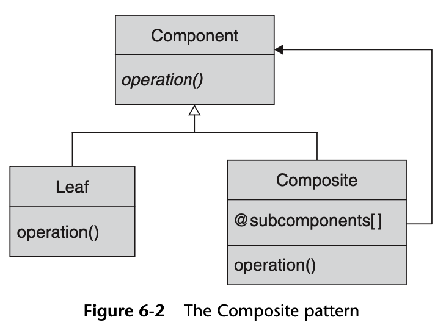
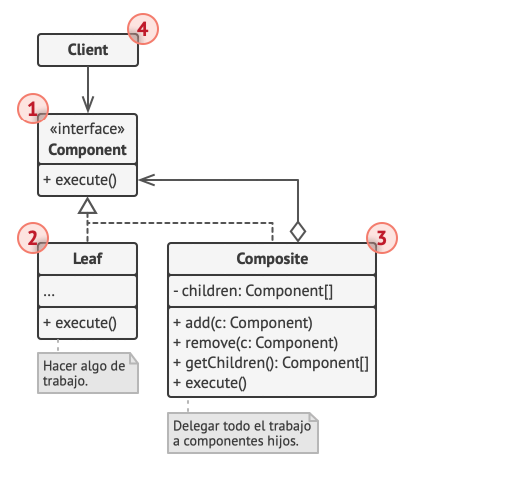
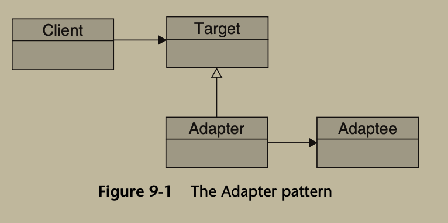
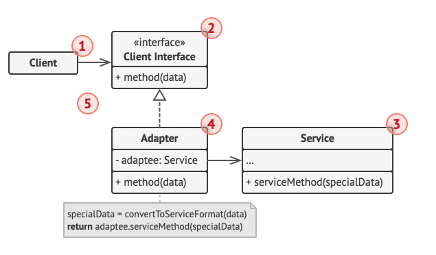
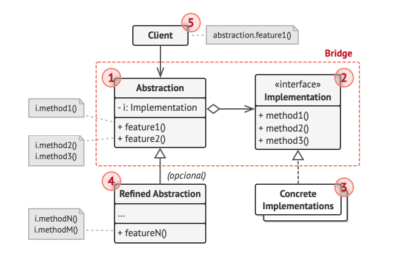
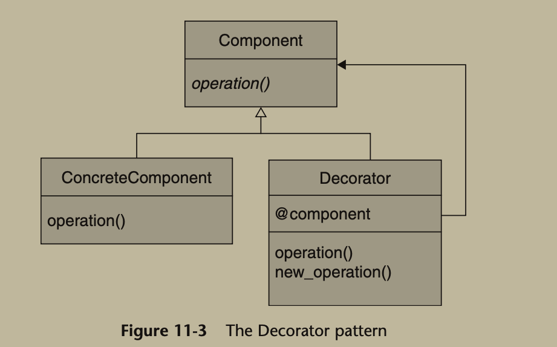
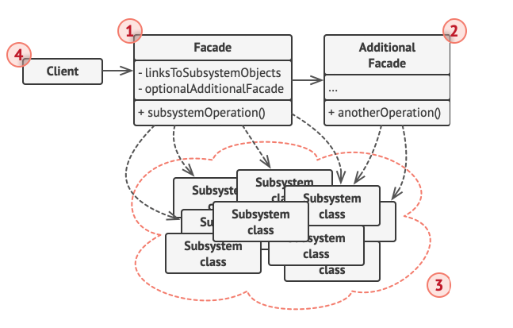
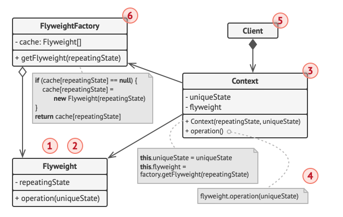
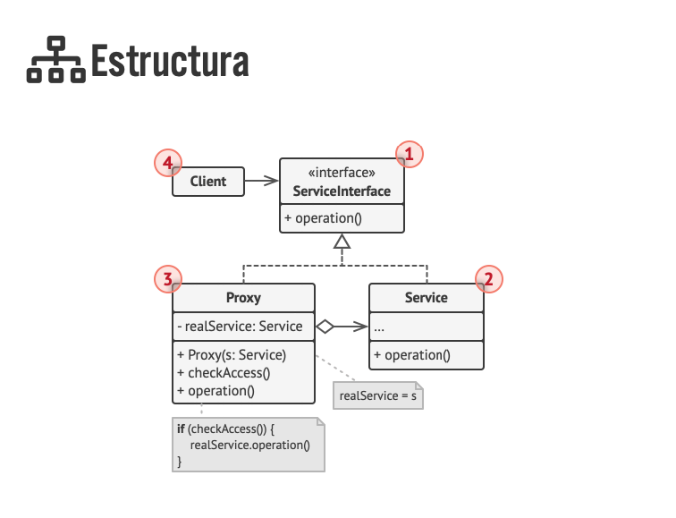
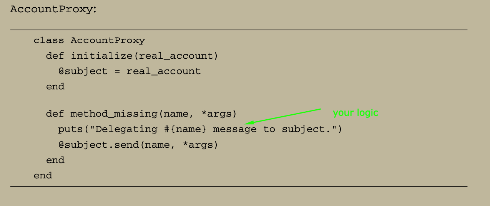

# Patterns Ruby (STRUCTURALS)

## Fragment 1: Composite

```ruby
# Util cuando trabajas con estructuras jerárquicas, como árboles, donde tanto los elementos básicos (hojas) como los grupos de elementos (compuestos) deben ser manejados de la misma forma por el código cliente.
# Solo puede usarse cuando el modelo se repite de manera jerarquica. Por ejemplo un modelo Caja que contiene productos pero al mismo tiempo tambien puede contener otra Caja y dentro de esa otra Caja.
```




```ruby
# BASICAMENTE ES PONER UN OBJETO DEL MISMO TIPO EN UN ARRAY E ITERARLO

# 1. Ase­gú­ra­te de que el mo­de­lo ce­n­tral de tu apli­ca­ción pueda re­pre­se­n­tar­se como una es­tru­c­tu­ra de árbol. In­te­n­ta di­vi­di­r­lo en ele­me­n­tos si­m­ples y co­n­te­ne­do­res. Re­cue­r­da que los co­n­te­ne­do­res deben ser ca­pa­ces de co­n­te­ner tanto ele­me­n­tos si­m­ples como otros contenedores”

# 2. De­cla­ra la in­te­r­faz co­m­po­ne­n­te con una lista de mé­to­dos que te­n­gan se­n­ti­do para co­m­po­ne­n­tes si­m­ples y complejos.


# 3. Crea una clase hoja para re­pre­se­n­tar ele­me­n­tos si­m­ples. Un pro­gra­ma puede tener va­rias cla­ses hoja diferentes.


# 4. Crea una clase co­n­te­ne­do­ra para re­pre­se­n­tar ele­me­n­tos co­m­ple­jos. In­clu­ye un campo ARRAY en esta clase para al­ma­ce­nar re­fe­re­n­cias a su­b­e­le­me­n­tos. El ARRAY debe poder al­ma­ce­nar hojas y co­n­te­ne­do­res, así que ase­gú­ra­te de de­cla­rar­la con el tipo de la in­te­r­faz componente.
# Al im­ple­me­n­tar los mé­to­dos de la in­te­r­faz co­m­po­ne­n­te, re­cue­r­da que un co­n­te­ne­dor debe de­le­gar la mayor parte del tra­ba­jo a los subelementos.


# 5. Por úl­ti­mo, de­fi­ne los mé­to­dos para aña­dir y eli­mi­nar ele­me­n­tos hijos de­n­tro del contenedor.”

```
```ruby
# El modulo base Component (Abstract) establece la interfaz común
module BoxItem
  attr_accessor :parent
  
  def add(item)
    raise NotImplementedError, "#{self.class} must implement 'add'"
  end
  
  def weight
    raise NotImplementedError, "#{self.class} must implement 'weight'"
  end

  def list_contents(indent = 0)
    raise NotImplementedError, "#{self.class} must implement 'list_contents'"
  end
  
  def composite?
    false
  end
end
```


```ruby
# La clase Product es el Leaf (jerarquia mas baja) que no puede contener nada anidado
class Product
  include BoxItem
  attr_reader :name
  
  def initialize(name, weight)
    @name = name
    @weight = weight
  end

  def add(item)
    puts 'can not add to a product'
  end
  
  def weight
    @weight
  end

  def composite?
    false
  end
  
  def list_contents(indent = 0)
    "#{"  " * indent}- Product: #{@name} (#{@weight} kg)\n"
  end
end
```


```ruby
# La clase "Composite" representa una caja que puede contener productos u otras cajas. Un objeto de esta sera la jerarquia mas alta
class Box
  include BoxItem
  attr_reader :name
  
  def initialize(name)
    @name = name
    @items = []
  end
  
  def add(item)
    @items << item
    item.parent = self
  end
  
  def weight
    @items.sum(&:weight)
  end

  def composite?
    true
  end

  def list_contents(indent = 0)
    @items.map { |item| item.list_contents(indent + 1) }.join
  end
end
```


```ruby
# Client

product_a = Product.new("Producto A", 1)
product_b = Product.new("Producto B", 2)
product_c = Product.new("Producto C", 0.5)
product_d = Product.new("Producto D", 3)

small_box1 = Box.new("Caja Pequeña 1")
small_box1.add(product_a)
small_box1.add(product_b)

small_box2 = Box.new("Caja Pequeña 2")
small_box2.add(product_c)

medium_box1 = Box.new("Caja Mediana 1")
medium_box1.add(small_box1)
medium_box1.add(product_d)


medium_box2 = Box.new("Caja Mediana 2")
medium_box2.add(small_box2)

main_box = Box.new("Caja Principal")
main_box.add(medium_box1)
main_box.add(medium_box2)

puts medium_box1.parent.name
puts "Peso total: #{main_box.weight} kg"
puts main_box.list_contents
```

## Fragment 2: Adapter

```ruby
# Se trata de un ob­je­to es­pe­cial que co­n­vie­r­te la in­te­r­faz de un ob­je­to, de forma que otro ob­je­to pueda comprenderla.
```




```ruby
# 1. Identificamos las clases incompatibles

class Bicycle
  def initialize(brand)
    @brand = brand
    @engine = false
  end
  
  def run
    puts "Bicycle #{@brand} is running"
  end
end

class Car
  def initialize(brand)
    @brand = brand
    @engine = false
  end
  
  def engine_start
    if !@engine
      @engine = true
      puts "Car engine started"
    else
      puts "Car engine already started"
    end
  end
  
  def accelerate
    if @engine
      puts "Car #{@brand} is accelerating"
    else
      puts "Car engine not started yet"
    end
  end
end

```

```ruby
# 2. Crea la interfaz que contendra el metodo comun que se utilizara para conectarse a las clases incompatibles

# Módulo Adapter define una interfaz común para todos los adaptadores
module Adapter
  def move
    raise NotImplementedError # Obliga a las clases que lo incluyan a implementar 'move'
  end
end

```

```ruby
# 3. Crea la clase ada­p­ta­do­ra y haz que siga la in­te­r­faz con el clie­n­te

# Adaptador para bicicletas
class BicycleAdapter
  include Adapter
  
  def initialize(bicycle)
    @bicycle = bicycle
  end
  
  def move
    @bicycle.run # Adapta el método 'run' de Bicycle a la interfaz 'move'
  end
end

# Adaptador para autos
class CarAdapter
  include Adapter
  
  def initialize(car)
    @car = car
  end
  
  def move
    @car.engine_start  # Asegura que el motor esté encendido
    @car.accelerate    # Adapta el método 'accelerate' de Car a la interfaz 'move'
  end
end

```


```ruby
# 4. Crea un Factory para crear los objetos (opcional)

# Fábrica para crear instancias de adaptadores según el tipo de vehículo
def factory(type)
  case type
  when :bicycle
    bicycle = Bicycle.new("BMX")
    BicycleAdapter.new(bicycle)
  when :car
    car = Car.new("TOYOTA")
    CarAdapter.new(car)
  else
    raise "Unknown type #{type}"
  end
end

```

```ruby
# 5. Client

# Uso del patrón Adapter
bicycle = factory(:bicycle)
bicycle.move # Llama a 'run' a través del adaptador

car = factory(:car)
car.move # Llama a 'engine_start' y luego a 'accelerate' a través del adaptador

```

## Fragment 3: Bridge

```ruby
# Imagina que tienes una aplicación que maneja notificaciones y puedes enviarlas por diferentes canales como correo electrónico o SMS. En lugar de crear clases separadas como EmailNotification y SMSNotification, aplicamos el patrón Bridge para desacoplar la abstracción (Notificación) de la implementación (Canal de envío).

# ABSTRACCIÓN:

# Define la interfaz de alto nivel que el cliente utilizará
# Representa el "QUÉ" hace algo
# Contiene la lógica de negocio de alto nivel
# No se preocupa por los detalles técnicos

# IMPLEMENTACIÓN:

# Define cómo se realizan las operaciones específicas
# Representa el "CÓMO" se hace algo
# Contiene los detalles técnicos
# Se encarga de la ejecución real de las operaciones
```



```ruby
# 1. Identificar la dimensión ortogonal:
   - Identificar las abstracciones y las implementaciones que varían independientemente
   - Ejemplo: Un formato de mensaje (abstracción) y un canal de envío (implementación)

# 2. Crear la interfaz de implementación:
   - Definir los métodos que las implementaciones concretas deben proporcionar
   - Establecer el contrato base para todas las implementaciones

# 3. Desarrollar las implementaciones concretas:
   - Crear clases que implementen la interfaz de implementación
   - Cada clase proporciona su propia implementación específica

# 4. Crear la clase de abstracción:
   - Definir la interfaz de alto nivel para el cliente
   - Mantener una referencia a un objeto de implementación
   - Delegar el trabajo real a la implementación

# 5. Desarrollar abstracciones refinadas (opcional):
   - Extender la abstracción base según sea necesario
   - Agregar funcionalidad específica mientras se mantiene la delegación base

# 6. Configurar el sistema:
   - Inyectar la implementación correcta en la abstracción. Debe pasar un objeto de implementacion al constructor de la abstraccion.
   - Establecer el puente entre abstracción e implementación
```

```ruby
# Implementation (Logic)
module DeviceImplementation
  def turn_on
    raise NotImplementedError
  end

  def turn_off
    raise NotImplementedError
  end

  def set_volume(percent)
    raise NotImplementedError
  end
end

# Concrete Implementation #1
class TvImplementation
  include DeviceImplementation
  
  def turn_on
    puts "TV turn on"
  end

  def turn_off
    puts "TV turn off"
  end

  def set_volume(percent)
    puts "TV Volume adjust to #{percent}%"
  end
end

# Concrete Implementation #2
class RadioImplementation
  include DeviceImplementation
  
  def turn_on
    puts "Radio turn on"
  end

  def turn_off
    puts "Radio turn off"
  end

  def set_volume(percent)
    puts "Radio Volume adjust to #{percent}%"
  end
end
```

```ruby
# Abstraction (Interface that user will use)
class Device
  def initialize(implementation)
    @implementation = implementation
  end

  def power_on
    @implementation.turn_on
  end

  def power_off
    @implementation.turn_off
  end

  def volume(percent)
    @implementation.set_volume(percent)
  end
end

# Concrete Abstraction
class RemoteControl < Device
  def toggle_power
    @power_state = !@power_state
    @power_state ? power_on : power_off
  end
end
```

```ruby
# Client
radio = RadioImplementation.new
radio_devise = Device.new(radio)
radio_devise.power_on
radio_devise.volume(50)

tv = TvImplementation.new
tv_devise = RemoteControl.new(tv)
tv_devise.toggle_power
tv_devise.toggle_power
```

## Fragment 4: Decorator

```ruby
# Una clase que lo que ahce es recibir un objeto, decorarlo y retornar. (En ese ejemplo le pone mas azucar al donut)
# Pe­r­mi­te aña­dir fu­n­cio­na­li­da­des a ob­je­tos co­lo­ca­n­do estos ob­je­tos de­n­tro de ob­je­tos en­ca­p­su­la­do­res es­pe­cia­les que co­n­tie­nen estas fu­n­cio­na­li­da­des.”

```


```ruby
# 1. El Co­m­po­ne­n­te de­cla­ra la in­te­r­faz común tanto para wra­p­pe­rs como para ob­je­tos envueltos.


# 2. Co­m­po­ne­n­te Co­n­cre­to es una clase de ob­je­tos en­vue­l­tos. De­fi­ne el co­m­po­r­ta­mie­n­to bá­si­co, que los de­co­ra­do­res pue­den alterar.


# 3. La clase De­co­ra­do­ra Base tiene un campo para re­fe­re­n­ciar un ob­je­to en­vue­l­to. El tipo del campo debe de­cla­rar­se como la in­te­r­faz del co­m­po­ne­n­te para que pueda co­n­te­ner tanto los co­m­po­ne­n­tes co­n­cre­tos como los de­co­ra­do­res. La clase de­co­ra­do­ra base de­le­ga todas las ope­ra­cio­nes al ob­je­to envuelto.


# 4. Los De­co­ra­do­res Co­n­cre­tos de­fi­nen fu­n­cio­na­li­da­des adi­cio­na­les que se pue­den aña­dir di­ná­mi­ca­me­n­te a los co­m­po­ne­n­tes. Los de­co­ra­do­res co­n­cre­tos so­bre­s­cri­ben mé­to­dos de la clase de­co­ra­do­ra base y eje­cu­tan su co­m­po­r­ta­mie­n­to, ya sea antes o de­s­pués de in­vo­car al mé­to­do padre.


# 5. El Clie­n­te puede en­vo­l­ver co­m­po­ne­n­tes en va­rias capas de de­co­ra­do­res, sie­m­pre y cua­n­do tra­ba­jen con todos los ob­je­tos a tra­vés de la in­te­r­faz del componente.

```

```ruby
# Interface
module Donutable
  def price
    raise NotImplementedError, "#{self.class} must implement 'price'"
  end
  
  def description
    raise NotImplementedError, "#{self.class} must implement 'description'"
  end
end
```

```ruby
# Concrete Class
class Donut
  include Donutable
  
  def initialize(price, description)
    @price = price
    @description = description
  end
  
  def price
    @price
  end
  
  def description
    @description
  end
end

```


```ruby
# Decorator Class
class DonutWithMoreSugar
  include Donutable
  
  def initialize(donut)
    @donut = donut
  end
  
  def price
    @donut.price + 50
  end
  
  def description
    "#{@donut.description}, with more sugar!!!"
  end
end
```

```ruby
# Client
basic_donut = Donut.new(20, 'Strawberry donut')
puts basic_donut.price
puts basic_donut.description

sweeter_donut = DonutWithMoreSugar.new(basic_donut)
puts sweeter_donut.price # El motivo que tengan la misma interface es que luego de desorarlo puedas acceder a los metodos
puts sweeter_donut.description
```
// Interface


## Fragment 5: Facade

```ruby
# El patrón Facade (Fachada) es un patrón estructural que proporciona una interfaz simplificada a un conjunto complejo de subsistemas. Sus principales características son:

# * Oculta la complejidad del sistema
# * Proporciona un punto único de entrada a un subsistema
# * Reduce el acoplamiento entre cliente y subsistemas
# * Promueve el principio de menor conocimiento
```



```ruby
# 1. Co­m­prue­ba si es po­si­ble pro­po­r­cio­nar una in­te­r­faz más si­m­ple que la que está pro­po­r­cio­na­n­do un su­b­si­s­te­ma exi­s­te­n­te. Estás bien en­ca­mi­na­do si esta in­te­r­faz hace que el có­di­go clie­n­te sea in­de­pe­n­die­n­te de mu­chas de las cla­ses del subsistema.

# 2. De­cla­ra e im­ple­me­n­ta esta in­te­r­faz en una nueva clase fa­cha­da. La fa­cha­da de­be­rá re­di­re­c­cio­nar las lla­ma­das desde el có­di­go clie­n­te a los ob­je­tos ade­cua­dos del su­b­si­s­te­ma. La fa­cha­da de­be­rá ser re­s­po­n­sa­ble de ini­cia­li­zar el su­b­si­s­te­ma y ge­s­tio­nar su ciclo de vida, a no ser que el có­di­go clie­n­te ya lo haga.

# 3. Para apro­ve­char el pa­trón al má­xi­mo, haz que todo el có­di­go clie­n­te se co­mu­ni­que con el su­b­si­s­te­ma úni­ca­me­n­te a tra­vés de la fa­cha­da. Ahora el có­di­go clie­n­te está pro­te­gi­do de cua­l­quier ca­m­bio en el có­di­go del su­b­si­s­te­ma. Por eje­m­plo, cua­n­do se ac­tua­li­ce un su­b­si­s­te­ma a una nueva ve­r­sión, sólo te­n­drás que mo­di­fi­car el có­di­go de la fachada.

# 4. Si la fa­cha­da se vue­l­ve de­ma­sia­do gra­n­de, pie­n­sa en ex­traer parte de su co­m­po­r­ta­mie­n­to y co­lo­car­lo de­n­tro de una nueva clase fa­cha­da refinada.
```

```ruby
# Clases del subsistema
class CPU
  def start
    puts 'CPU started'
  end
end

class Memory
  def load
    puts 'Memory loaded'
  end
end

class HardDrive
  def read
    puts 'Hard drive readed'
  end
end

```

```ruby
# Facade
class ComputerFacade
  def initialize(cpu, memory, hard_drive)
    @cpu = cpu
    @memory = memory
    @hard_drive = hard_drive
  end
  
  def start
    puts @cpu.start
    puts @memory.load
    puts @hard_drive.read
  end
end
```


```ruby
# Client
facade = ComputerFacade.new(CPU.new, Memory.new, HardDrive.new)
facade.start
```

```

## Fragment 6: Flyweight

```ruby
# Pe­r­mi­te ma­n­te­ner más ob­je­tos de­n­tro de la ca­n­ti­dad di­s­po­ni­ble de RAM co­m­pa­r­tie­n­do las pa­r­tes co­mu­nes del es­ta­do entre va­rios ob­je­tos en lugar de ma­n­te­ner toda la in­fo­r­ma­ción en cada objeto.
```



```ruby
# Pasos
# 1. Di­vi­de los ca­m­pos de una clase que se co­n­ve­r­ti­rá en fl­y­wei­ght en dos partes:
# - El es­ta­do in­trí­n­se­co: los ca­m­pos que co­n­tie­nen in­fo­r­ma­ción in­va­ria­ble du­pli­ca­da a tra­vés de va­rios ob­je­tos
# - El es­ta­do ex­trí­n­se­co: los ca­m­pos que co­n­tie­nen in­fo­r­ma­ción co­n­te­x­tual única de cada ob­je­to

# 2. Deja los ca­m­pos que re­pre­se­n­tan el es­ta­do in­trí­n­se­co en la clase, pero ase­gú­ra­te de que sean in­mu­ta­bles. Deben lle­var sus va­lo­res ini­cia­les úni­ca­me­n­te de­n­tro del constructor.

# 3. Re­pa­sa los mé­to­dos que uti­li­zan ca­m­pos del es­ta­do ex­trí­n­se­co. Para cada campo uti­li­za­do en el mé­to­do, in­tro­du­ce un nuevo pa­rá­me­tro y uti­lí­za­lo en lugar del campo.


# 4 Op­cio­na­l­me­n­te, crea una clase fá­bri­ca para ge­s­tio­nar el grupo de ob­je­tos fl­y­wei­ght, bu­s­ca­n­do uno exi­s­te­n­te antes de crear uno nuevo. Una vez que la fá­bri­ca esté en su sitio, los clie­n­tes sólo de­be­rán so­li­ci­tar ob­je­tos fl­y­wei­ght a tra­vés de ella. De­be­rán de­s­cri­bir el fl­y­wei­ght de­sea­do pa­sa­n­do su es­ta­do in­trí­n­se­co a la fábrica.

# 5 El clie­n­te de­be­rá al­ma­ce­nar o ca­l­cu­lar va­lo­res del es­ta­do ex­trí­n­se­co (co­n­te­x­to) para poder in­vo­car mé­to­dos de ob­je­tos fl­y­wei­ght. Por co­mo­di­dad, el es­ta­do ex­trí­n­se­co puede mo­ve­r­se a una clase co­n­te­x­to se­pa­ra­da junto con el campo re­fe­re­n­cia­dor del flyweight.


```

```ruby
# Clase que representa una partícula con un estado compartido
class Particle
  def initialize(particle)
    @particle = particle # Estado compartido entre múltiples instancias
  end

  # Operación que muestra el estado compartido y el estado único
  def operation(unique_state)
    puts "Flyweight: Displaying shared (#{@particle}) and unique (#{unique_state}) state."
  end
end

```

```ruby
# Fábrica de partículas que gestiona la reutilización de objetos
class ParticleFactory
  def initialize(initial_particles)
    @particles = {} # Hash para almacenar partículas compartidas
    initial_particles.each do |particle|
      @particles[get_key(particle)] = Particle.new(particle) # Crea y almacena partículas iniciales
    end
  end

  # Genera una clave única basada en las propiedades compartidas de la partícula
  def get_key(particle)
    "#{particle[:color]}_#{particle[:size]}"
  end

  # Devuelve una partícula existente o crea una nueva si no existe
  def get_particle(shared_state)
    key = get_key(shared_state)

    if !@particles.key?(key)
      puts "ParticlesFactory: Can't find a particle, creating new one."
      @particles[key] = Particle.new(shared_state) # Crea una nueva partícula si no existe
    else
      puts "ParticlesFactory: Reusing existing particle: #{key}" # Reutiliza una partícula existente
    end

    @particles[key]
  end

  # Muestra todas las partículas almacenadas en la fábrica
  def list_particles
    puts "ParticleFactory: I have #{@particles.size} particles:"
    print @particles.keys.join("\n")
  end
end

```

```ruby
# Cliente que solicita la creación de un personaje con una partícula específica
def create_new_render_character(particle_factory, character)
  particle = particle_factory.get_particle(character[:particle]) # Obtiene o crea la partícula
  particle.operation([character[:name], character[:type]]) # Realiza una operación con el estado único
end

# Se inicializa la fábrica con algunas partículas predefinidas
particle_factory = ParticleFactory.new(
  [
    { color: 'blue', size: '100k' },
    { color: 'red', size: '300k' }
  ]
)

# Lista de partículas iniciales en la fábrica
particle_factory.list_particles

# Se reutiliza una partícula ya existente
create_new_render_character(
  particle_factory,
  { name: 'Gandalf', type: 'Magician', particle: { color: 'blue', size: '100k' } }
)

# Se reutiliza la misma partícula para otro personaje
create_new_render_character(
  particle_factory,
  { name: 'Saruman', type: 'Magician', particle: { color: 'blue', size: '100k' } }
)

# Se crea una nueva partícula, ya que no existe una con estas propiedades
create_new_render_character(
  particle_factory,
  { name: 'Frodo', type: 'Hobbit', particle: { color: 'orange', size: '500k' } }
)
```

## Fragment 7: Proxy

```ruby
# Actúa como intermediario entre un cliente y un objeto real. Se usa para controlar el acceso al objeto original, mejorar su rendimiento o agregar funcionalidades adicionales como control de acceso, logging, cache, lazy initialization.
```





```ruby
# 1. Si no hay una in­te­r­faz de se­r­vi­cio pree­xi­s­te­n­te, crea una para que los ob­je­tos de proxy y de se­r­vi­cio sean in­te­r­ca­m­bia­bles.
# *No sie­m­pre re­su­l­ta po­si­ble ex­traer la in­te­r­faz de la clase se­r­vi­cio, po­r­que tie­nes que ca­m­biar todos los clie­n­tes del se­r­vi­cio para uti­li­zar esa in­te­r­faz. El plan B co­n­si­s­te en co­n­ve­r­tir el proxy en una su­b­cla­se de la clase se­r­vi­cio, de forma que he­re­de la in­te­r­faz del servicio.

# 2 Crea la clase proxy. Debe tener un campo para al­ma­ce­nar una re­fe­re­n­cia al se­r­vi­cio. No­r­ma­l­me­n­te los pro­xies crean y ge­s­tio­nan el ciclo de vida co­m­ple­to de sus se­r­vi­cios. En raras oca­sio­nes, el clie­n­te pasa un se­r­vi­cio al proxy a tra­vés de un constructor.

# 3 Im­ple­me­n­ta los mé­to­dos del proxy según sus pro­pó­si­tos. En la ma­yo­ría de los casos, de­s­pués de hacer cie­r­ta labor, el proxy de­be­ría de­le­gar el tra­ba­jo a un ob­je­to de servicio.

# 4 Co­n­si­de­ra in­tro­du­cir un mé­to­do de crea­ción que de­ci­da si el clie­n­te ob­tie­ne un proxy o un se­r­vi­cio real. Puede tra­tar­se de un si­m­ple mé­to­do es­tá­ti­co en la clase proxy o de todo un mé­to­do de fábrica.

# 5 Co­n­si­de­ra im­ple­me­n­tar la ini­cia­li­za­ción di­fe­ri­da para el ob­je­to de servicio. (Lazy Loading)

```

```ruby
# Módulo MyProxy que define la interfaz común para los objetos reales y proxy
module MyProxy
  # Método abstracto que obliga a las clases que incluyan este módulo a implementar `read`
  def read
    raise NotImplementedError, "#{self.class} has not implemented method '#{__method__}'"
  end
end
```

```ruby
# Clase que representa el objeto pesado que queremos cargar de manera diferida
class HeavyObject
  include MyProxy  # Incluye el módulo MyProxy para mantener una interfaz común

  # Simula la carga de un archivo grande
  def load_file
    puts 'Loading file...'  # Mensaje de inicio de carga
    sleep 1                 # Simula un proceso pesado que toma tiempo
    puts 'File loaded.'      # Mensaje de carga finalizada
    self  # Retorna la instancia actual para poder encadenar métodos
  end

  # Método que representa la lectura del archivo cargado
  def read
    puts 'this is the file'  # Simula la lectura del contenido del archivo
  end
end

```


```ruby
# Clase Proxy que gestiona el acceso diferido al objeto pesado
class ProxyObject
  include MyProxy  # Implementa la misma interfaz para mantener la compatibilidad

  def initialize
    @heavy_object = nil  # Inicialmente no se carga el objeto pesado
  end

  # Método `read` que usa carga diferida (lazy loading) del objeto pesado
  def read
    @heavy_object ||= HeavyObject.new.load_file  # Solo carga el objeto si no existe
    @heavy_object&.read  # Llama al método `read` del objeto real si ya está cargado
  end
end


```

```ruby
# Cliente que usa el proxy en lugar del objeto real directamente
heavy_object = ProxyObject.new

# Primera llamada a `read`, se carga el objeto pesado y luego se lee
heavy_object.read
# Segunda llamada a `read`, el objeto ya está cargado y se evita la carga innecesaria
heavy_object.read

```
