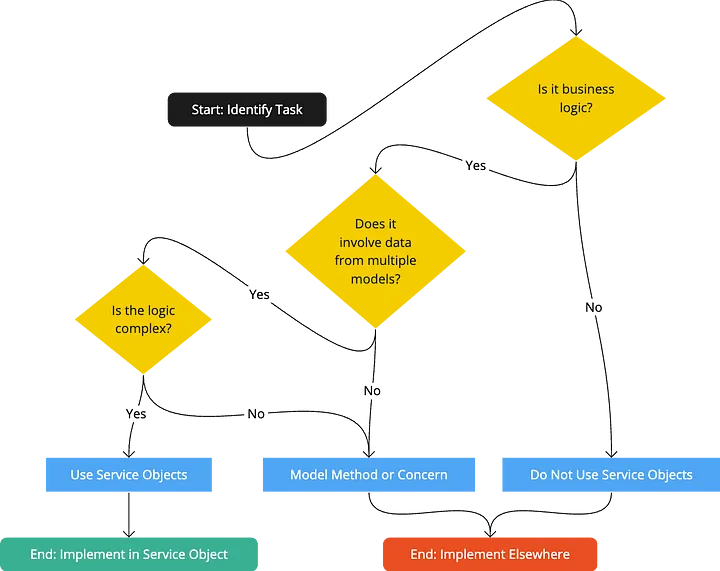

# Patterns RUBY

## Fragment 1: Railway Oriented Programming

```ruby
# Primero, creamos un módulo Result para manejar éxitos y fracasos
module Result
  class Success
    attr_reader :value
    
    def initialize(value)
      @value = value
    end

    def success?
      true
    end

    def bind(&block)
      block.call(@value)
    end
  end

  class Failure
    attr_reader :error
    
    def initialize(error)
      @error = error
    end

    def success?
      false
    end

    def bind(&_block)
      self
    end
  end
end

# Ejemplo de uso en un servicio de creación de usuario
class UserCreationService
  def self.create(params)
    validate_params(params)
      .bind { |valid_params| create_user(valid_params) }
      .bind { |user| send_welcome_email(user) }
  end

  private

  def self.validate_params(params)
    if params[:email].present? && params[:password].present?
      Result::Success.new(params)
    else
      Result::Failure.new("Parámetros inválidos")
    end
  end

  def self.create_user(params)
    user = User.new(params)
    if user.save
      Result::Success.new(user)
    else
      Result::Failure.new(user.errors.full_messages.join(", "))
    end
  end

  def self.send_welcome_email(user)
    UserMailer.welcome_email(user).deliver_now
    Result::Success.new(user)
  rescue StandardError => e
    Result::Failure.new("Error enviando email: #{e.message}")
  end
end

# Uso del servicio
result = UserCreationService.create(email: "user@example.com", password: "password123")

if result.success?
  puts "Usuario creado exitosamente: #{result.value.email}"
else
  puts "Error: #{result.error}"
end
```

## Fragment 2: Result Objects

```ruby
# Encapsula tanto los resultados exitosos como los errores en un solo objeto, evitando excepciones y mejorando la legibilidad del código
```
```ruby
# SERVICE
class PaymentService
  def initialize(user, amount)
    @user = user
    @amount = amount
  end

  def call
    process_payment
  end

  private

  def failure(message)
    Result.new(success: false, error: message)
  end

  def success(data = {})
    Result.new(success: true, data: data)
  end

  def process_payment
    return failure('invalid amount') unless @amount.positive?

    ActiveRecord::Base.transaction do
      # Logic
      success({ result: 'success' })
    rescue StandardError => e
      failure(e.message)
    end
  end
end
```

```ruby
# RESULT
class Result
  attr_reader :success, :error, :data

  def initialize(success:, error: nil, data: nil)
    @success = success
    @error = error
    @data = data
  end

  def success?
    @success
  end
end

```

```ruby
# CONTROLLER
payment_service = PaymentService.new(User.find(1), 0).call
if payment_service.success?
  puts('yeah')
else
  puts('nop')
end

```

## Fragment 3: Service Object

```ruby
class MyService
  attr_reader :errors
  
  def initialize(data)
    @data = data
    @error = nil # @errors = []
  end
  
  def call
    start_logic
  end
  
  private
  
  def start_logic
    # ...
  end
end
```


