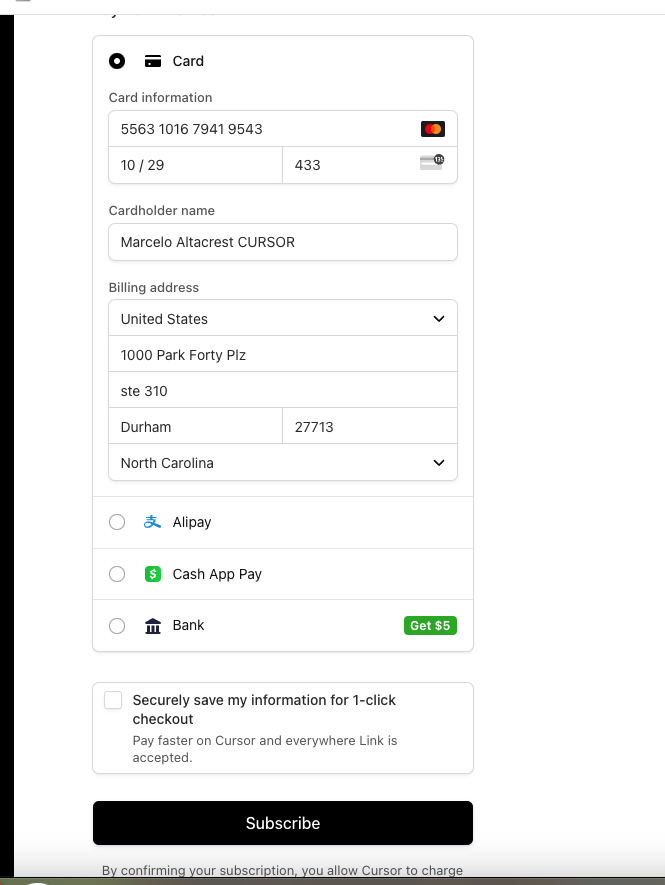

# credentials XENVIO

## Fragment 1: Basic

```shell
# Gitlab
marcelo.alarcon@shipedge.com
pass: google


Personal Access Tokens: <GITLAB_TOKEN>
Personal access Token Cubing 2025: <GITLAB_TOKEN_2025>
# Si generaste un nuevo token actualiza la url del remote:
git remote set-url origin https://marcelo.alarcon:<GITLAB_TOKEN>@gitlab.com/altacrest/x5.xenvio.git
# Mejor puedes usar un gestor de contrasenas:
git config --global credential.helper osxkeychain
git push
#aca te pedira las credenciales solo una vez si no funciona borra el cache: git credential-cache exit


Feed token: <GITLAB_FEED_TOKEN>
Incoming email token: <GITLAB_EMAIL_TOKEN>
# Git Clone
git clone https://marcelo.alarcon:<GITLAB_TOKEN>@gitlab.com/altacrest/x5.xenvio.git

# SSH
ssh malarcon@dev.shipedge.com -p 10022
pass <SSH_PASSWORD>

# Clickup
marcelo.alarcon@altacrest.dev
lobo last

# Mattermost
server: team.shipedge.com

# Claude
# (magic link — ver CREDENTIALS.md)
```


```shell
Bajar archivo:
scp -P 10022 malarcon@dev.shipedge.com:/home/malarcon/x5_development.sql ./nuevo.sql

# CAPISTRANO BRANCH VERSION
cap x5demo1 deploy REVISION=f9330fdf9

# SSH
pass: <SSH_PASSWORD>
ssh x5demo1@dev.shipedge.com -p 10022
ssh x5demo2@dev.shipedge.com -p 10022
cap x5demo1 deploy BRANCH=XEN-12-M

ssh x5dev@dev.shipedge.com -p 10022
cap dev deploy BRANCH=XEN-12-M

ssh x5test@dev.shipedge.com -p 10022
cap test deploy BRANCH=XEN-12-M

ssh cubingtest@dev.shipedge.com -p 10022
cap test deploy BRANCH=XEN-32-M
secret: "<CUBING_SECRET>"

ssh x52@xenvio.shipedge.com -p 10022

# Users:
usuario test: test@send.com / test123
usuario admin: admin@send.com
password: <ADMIN_PASSWORD>
# SSO XENVIO
marcelo.alarcon@shipedge.com
Qwerty123$


gmail
xenvio-no-reply@shipedge.com
<GMAIL_PASSWORD>
2 factor: <2FA_CODE>
xenvio_mail_v1
<GMAIL_APP_PASSWORD>

X3
x3.shipedge.com
test@send.com
<X3_PASSWORD>

omnio06.shipedge.com
oms@shipedge.com
<OMS_PASSWORD>
```

```shell

# DHL API
https://developer.dhl.com/
U: silvia@shipedge.com
P: <DHL_PASSWORD>

account_number: 799909537
API Key: <DHL_API_KEY>
API Secret: <DHL_API_SECRET>


# EzUSPS CREDENTIALS
api key <EASYPOST_KEY_1>
carrier account <CARRIER_ACCOUNT_1>

api key: <EASYPOST_KEY_2>
carrier account: <CARRIER_ACCOUNT_2>

api key: <EASYPOST_KEY_3>
carrier_account: <CARRIER_ACCOUNT_3>

# EAZY DAP
api key: <EASYPOST_KEY_3>
carrier acount: <CARRIER_ACCOUNT_DAP>

# EzUPS Mail innovation
api key: <EASYPOST_KEY_3>
carrier_acount: <CARRIER_ACCOUNT_UPS>

<CARRIER_ACCOUNT_EXTRA>
<EASYPOST_KEY_2>

#
```

```shell
# CUBING
secret: "<CUBING_SECRET>"
{
    "user": {
        "email": "marcelo.alarcon@shipedge.com",
        "password": "<CUBING_PASSWORD>",
        "invitation_token": "<INVITATION_TOKEN>"
    }
}

test:
Bearer <BEARER_TEST>

production:
Bearer <BEARER_PRODUCTION>


```




## Fragment 2: API Integration

**PRIMER PASO**
1. crear 2 archivos dentro la carpeta db/fixtures:
dhl_express_sandbox.rb
dhl_express.rb

2. En cualquiera de los archivos crear primeramente el carrier asi:
carrier = Carrier.new(
			name:        'DHL Express',
			description: 'DHL Express',
			url:         'https://www.dhlexpress.nl/en',
			special:     false,
			carrier_code: 'Dhl Express'
		)
carrier.save

3. Luego anadir los campos de autentificacion: (en este caso se necesita nombre de usuario, password y apikey)
Field.create(
    name: 'username',
    carrier_id: carrier.id
)

Field.create(
    name: 'password',
    carrier_id: carrier.id
)

Field.create(
    name: 'dhl-express-api-key',
    carrier_id: carrier.id
)

4. Adicionar los metodos de envios que te diga el product manager (el campo mas importante es el product_code que se usara para mandar el metodo en la integracion )
ShippingMethod.create(
	name:          'Express Worldwide',
	description:   'Express Worldwide',
	carrier_id:    carrier.id,
	international: true,
	product_code:  'WPX'
)

5. Verificar si tiene mail.type como por ejemplo UPS 
MailType.create(
    name: 'UPS Letter',
    carrier_code: '01',
    carrier_id: carrier.id
)


MailType.create(
    name: 'Customer Supplied Package',
    carrier_code: '02',
    carrier_id: carrier.id
)

6. bundle exec rake db:seed_fu FILTER=./db/fixtures/39_ehub_fedex.rb RAILS_ENV=production


**SEGUNDO PASO**

1. Crear un modulo y dentro la clase con el nombre del carrier y los parametros creados en el paso uno
module Carriers
  class DhlExpress
    include Functions

    def initialize(carrier_account_id)
            @carrier_account = CarrierAccount.find(carrier_account_id)
            dhl_params = get_parameters_carrier_account(carrier_account_id)

            @username = dhl_params['username'].to_s
            @password = dhl_params['password'].to_s
            @api_key = dhl_params['dhl-express-api-key'].to_s
            @base_url = 'https://express.api.dhl.com/mydhlapi/test'
    end
  end
end

2. Ir al model shipment y anadir:
El nombre que creaste en el fixture en el switch:
    a) def create_label
        when 'dhl_express'
          dhl_express = Carriers::DhlExpress.new(shipping_method_config.carrier_account_id)
          run = dhl_express.generate_label(self) ? true : false
       end

3. Ir a Xenvio y anadir un nuevo almacen carrier y metodo de envio:

4. Ir a Postman y crear un request:
POST: http://localhost:3000/api/v3/orders/new
 Header: 
 Email: test@send.com
 Token: <API_TOKEN>
 
 Body:
 {
    "orders": [
        {
            "order_number": "300_201", #cambiar esto para rastrear la orden desde la tabla shipments
            "ref_number": "",
            "order_date": "2023-12-29 13:39:38",
            "seller_name": "Shipedge",
            "comments": "",
            "category": "Chiefs BBQ Grill Set - DE",
            "currency": "usd",
            "warehouse": "Chelo", # poner el Warehouse creado
            "comments_warehouse": "&lt;br&gt;Ship method requested: USPS  EUSPMD",
            "url_logo": "",
            "label_ready": null,
            "third_party_account": null,
            "third_party_zip": null,
            "third_party_country": null,
            "num_items": 1,
            "policies": "\n",
            "promotion": "\n",
            "slogan": "",
            "latest_ship_date": null,
            "must_arrive_by_date": null,
            "batch_number": null,
            "shipments": [
                {
                    "shipment_number": "300_201", # mismo numero que "order_number"
                    "shipping_method_code": "333333", # el codigo del metodo de envio que se creo en la web
                    "carrier_code": "Dhl Express", # el carrier que estas creando
                    "return_label": "false",
                    "return_number": "",
                    "label_template": "6x4",
                    "page_size": "6x4",
                    "sample_label": "true",
                    "add_packing_list": "true",
                    "label_format": "pdf",
                    "create_label": true,
                    "category": "Chiefs BBQ Grill Set - DE",
                    "new_label": 0,
                    "pallets": [],
                    "pallets_info": [],
                    "shipping_services": {
                        "insurance": "10",
                        "require_signature": false,
                        "saturday_delivery": "false",
                        "residential": false,
                        "third_party_account": null,
                        "third_party_zip": null,
                        "third_party_country": null,
                        "cod": false,
                        "cod_amount": 0,
                        "bill_recipient": false,
                        "collect": false,
                        "incoterm": "DAP"
                    },
                    "customer": {
                        "title": "",
                        "first_name": "Bethany",
                        "last_name": "Smith",
                        "name": "Bethany Smith",
                        "email": "test@gmail.com",
                        "company": "",
                        "phone": "+12312312323",
                        "address1": "5146 Skyline Dr",
                        "address2": "",
                        "city": "Roeland Park",
                        "state": "KS",
                        "zip": "66205",
                        "country": "US"
                    },
                    "boxes": [
                        {
                            "box_number": "3011",
                            "weight": 1.8,
                            "length": 5,
                            "width": 5,
                            "height": 6,
                            "client_package_code": " 5 x 5 x 5",
                            "category": "100cm huge monkey plush",
                            "custom_label_tag1": "44248-#110",
                            "custom_label_tag2": "C-AEXAMPLE7-BIN-\/A1-200A005",
                            "custom_label_tag3": "4 x aliexpress-32890127625",
                            "items": [
                                {
                                    "sku": "aliexpress-32890127625",
                                    "upc": "",
                                    "description": "100cm huge monkey plush",
                                    "quantity": "4",
                                    "sold_price": 5,
                                    "country": "US",
                                    "harmonization": "",
                                    "weight": 0.4,
                                    "bin": "A1-200A005",
                                    "expiration_date": "0000-00-00",
                                    "lot_number": "",
                                    "uom": "",
                                    "amazon_item_id": ""
                                }
                            ]
                        },
                        {
                            "box_number": "3012",
                            "weight": 3.36,
                            "length": 6,
                            "width": 6,
                            "height": 7,
                            "client_package_code": " 6 x 6 x 6",
                            "category": "$10 Amazon Gift Card - GB",
                            "custom_label_tag1": "44248-#110",
                            "custom_label_tag2": "AAEXAMPLE5-BIN-\/KS1-200F2",
                            "custom_label_tag3": "3 x amazon.co.uk-B06XT5B8WY(1\/2)",
                            "items": [
                                {
                                    "sku": "amazon.co.uk-B06XT5B8WY",
                                    "upc": "",
                                    "description": "$10 Amazon Gift Card - GB",
                                    "quantity": "3",
                                    "sold_price": 10,
                                    "country": "US",
                                    "harmonization": "",
                                    "weight": 1,
                                    "bin": "KS1-200F2",
                                    "expiration_date": "0000-00-00",
                                    "lot_number": "",
                                    "uom": "",
                                    "amazon_item_id": ""
                                },
                                {
                                    "sku": "aliexpress-3256804355765626",
                                    "upc": "",
                                    "description": "Chihuahua Plush",
                                    "quantity": "2",
                                    "sold_price": 100,
                                    "country": "US",
                                    "harmonization": "",
                                    "weight": 0.03,
                                    "bin": "A1-200A010",
                                    "expiration_date": "0000-00-00",
                                    "lot_number": "",
                                    "uom": "",
                                    "amazon_item_id": ""
                                }
                            ]
                        },
                        {
                            "box_number": "3013",
                            "weight": 0.3,
                            "length": 5,
                            "width": 5,
                            "height": 6,
                            "client_package_code": " 5 x 5 x 5",
                            "category": "Chiefs BBQ Grill Set - DE",
                            "custom_label_tag1": "44248-#110",
                            "custom_label_tag2": "CATEGORY-PICKING-\/CP1-99A02",
                            "custom_label_tag3": "1 x amazon.de-B00AKIBRNQ",
                            "items": [
                                {
                                    "sku": "amazon.de-B00AKIBRNQ",
                                    "upc": "",
                                    "description": "Chiefs BBQ Grill Set - DE",
                                    "quantity": "1",
                                    "sold_price": 33.5,
                                    "country": "US",
                                    "harmonization": "",
                                    "weight": 0.1,
                                    "bin": "CP1-99A02",
                                    "expiration_date": "0000-00-00",
                                    "lot_number": "",
                                    "uom": "",
                                    "amazon_item_id": ""
                                }
                            ]
                        }
                    ]
                }
            ],
            "merchant": {
                "title": "",
                "first_name": "Manager",
                "last_name": "Manager",
                "name": "Manager Manager",
                "email": "testlisette123@gmail.com",
                "phone": "9456565667",
                "company": "Shipedge",
                "merchant_code": "15",
                "address1": "106 Capitola Dr",
                "address2": "",
                "city": "Durham",
                "state": "NC",
                "zip": "27713",
                "country": "US"
            }
        }
    ]
}


5. Ya puedes acceder a tu clase


## Fragment 3: Gems

```ruby
gem('rubocop', '~> 0.83.0')
gem('rubocop-rails', '~> 2.6')

gem('better_errors', '~> 2.10', group: :development)
gem('awesome_print')
gem('binding_of_caller', '~> 1.0', group: :development)

gem('letter_opener', group: :development)
gem('letter_opener_web', '~> 2.0')


#Rubocop

require:
  - rubocop-rails

AllCops:
  EnabledByDefault: true
  TargetRubyVersion: 2.7.5
  Exclude:
    - "**/db/**/*"
    - "**/config/**/*"
    - "**/bin/**/*"
    - "config.ru"
Style/Documentation:
  Enabled: false

Style/FrozenStringLiteralComment:
  Enabled: false

Style/Copyright:
  Enabled: false

Rails/UniqueValidationWithoutIndex:
  Enabled: false

Metrics/AbcSize:
  Enabled: false

Style/GuardClause:
  Enabled: false

Style/MissingElse:
  Enabled: false

Metrics/BlockLength:
  Enabled: false

Metrics/MethodLength:
  Enabled: false

Style/DocumentationMethod:
  Enabled: false

Layout/LineLength:
  Max: 120

Lint/NumberConversion:
  Enabled: false

Style/StringHashKeys:
  Enabled: false
  
Rails/SaveBang:
  Enabled: false
  
Style/Send:
  Enabled: false
  
Naming/AccessorMethodName:
  Enabled: false
```

## Fragment 4: Checklist Merge

1. Borrar las gemas personalizadas, anadir gemas de deploy si no estan y correr bundle
2. Arreglar formatos que se hayan cambiado
3. Hacer deploy
4. Testear en el server
